.. _GFV: 

General Features of valQ Custom Visual
======================================

Instructions for valQ Custom Visual 
------------------------------------

The valQ Custom Visual provides various components that the Designer can
use in conjunction with Microsoft Power BI. The valQ custom visual also
offers many configuration options.

In this guide, we will describe the common end user functionality using
a demo as an example. It is however important to understand that your
specific implementation may differ.

Once your designer has implemented and configured the valQ Custom
Visual, it will be accessed the same way you access your current Power
BI Apps.

When you open a valQ Custom Visual, it will open in a similar manner at
the screenshot below:

    valQ Screen

The left panel is the navigation panel and on the canvas you will find
the value driver tree. By default, the tree is open on collapsed mode at
a level defined by the designer. This is typically completely collapsed.

As part of the New Release, you will be able to hide the Navigation Panel in the Runtime by clicking the Collapse button as shown in the below Figure.

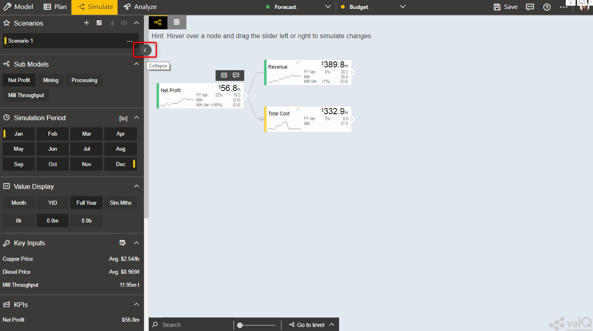

    Hiding Navigation Panel in Runtime 

As part of the New Release, you can also switch over from Table View Mode to Tree View Mode and vice versa using the button as shown in 
the below Figure.

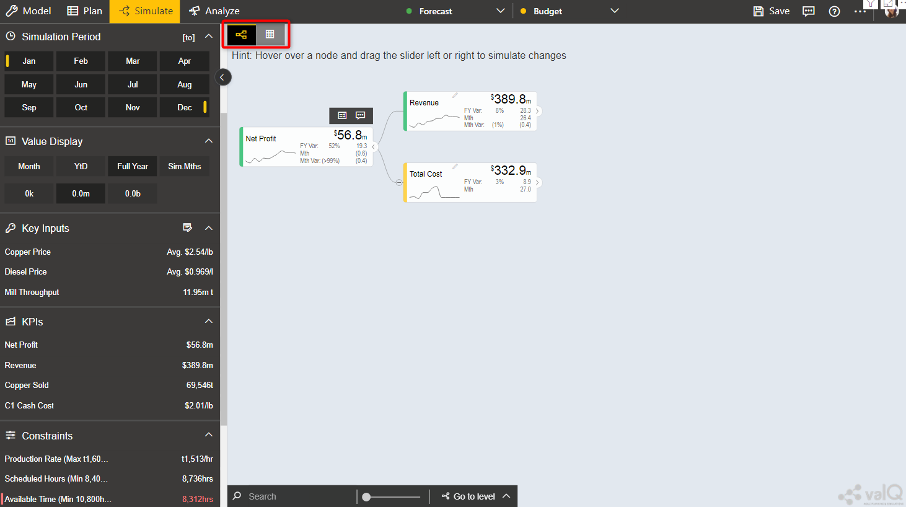

    Table/Tree View Mode 

Input Data
----------

The valQ Custom Visual works with two input data series – the primary
and the comparison data series. A common way of using this is to compare
Forecast vs Budget, Budget vs Last Year Actuals etc. The data series is
at a certain time grain. This would typically be 1 year by 12 months or
a multiyear view like 5 years plan by year.

The selecting of the time series will often be based on Filters or
Variables. A typical scenario is where the designer has defined 4
variables on the underlying data sources:

Primary:

Version: ie. Defaulted to Forecast

Year: ie. Defaulted to Current Year

Comparison:

Version ie. Defaulted to Budget

Year ie. Defaulted to Current Year

This allows the users to compare different versions and years in the
value driver tree model.

The valQ Custom Visual can display individual periods but can also apply
time aggregation such as Full Year, Year-to-Date. You can see the
currently selected Value Display aggregation on the Navigation Panel. In
the screenshot above, Full Year is selected. The primary value displayed
on the Widgets is therefore in this instance the Full Year aggregated
data.

Tree Drill Down
---------------

Nodes that has children will have an expand ‘>’ button to the right of
the Widget as highlighted below:

.. figure:: _static/4.2.png
    :align: center
    :alt: alternate text

    Nodes with children

You can drill down the tree by clicking the expand button.

The tree will focus on the branches that are being expanded. You can
collapse any specific node by clicking the ‘<’ collapse button on the
right of a widget.

Value Driver Trees are in reality networks. The same driver may impact
multiple aspects of the Tree. The component therefore contains a concept
of linked nodes. Such nodes have a link |..image::_static/image4| icon that you can click
which will jump to where the linked node is defined and highlight the
node:

.. figure:: _static/4.3.png
    :align: center
    :alt: alternate text

    Link

.. figure:: _static/4.4.png
    :align: center
    :width: 1000
    :alt: alternate text

    Linked Nodes

To collapse all the nodes, click on the Go to level icon in the bottom left of the canvas

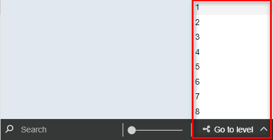

Zoom and Pan
------------

Value Driver Trees can be large. You can zoom and pan the canvas view.
If you are using an iPad or iPhone, you can zoom by pinching and pan by
dragging the same way you would navigate a map.

If you are using a mouse with a scroll wheel, you can point your curser
anywhere in the canvas and scroll the wheel to zoom in and out.

To pan, click and hold the left bottom of the mouse and drag the tree
around.

You can also use the zoom button to zoom if your device doesn’t support
other options 

Expand/Collapse of Tree View
----------------------------

As part of the New Release, you will be able to expand/collapse the Node Hierarchy at the required level using the Go To Level button (see Figure below). 

.. figure:: _static/exl.png
    :align: center
    :width: 1000
    :alt: alternate text

    Expand/collapse one level 

For our example, the Node Hierarchy level has been selected as third level.

Value Display and Simulation Period
-----------------------------------

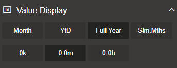

    Value Display

With the ‘Value Display’ functionality you can choose the time
aggregation you want to display as the primary value. The designer can
link certain nodes to a user selected scaling. You can select the scale
you wish to display by selecting this under the Value Display section.
Note that the options here can be configured so they may differ. It is
important to note that not all notes are scaled using this as the value
driver tree typically contains both amounts, prices, rates and physical
volumes.

In addition to the primary display value, the designer can also choose a
secondary value to be displayed. I.e. if you are showing Full Year as
primary, in the below example, it has been configured to visualize the
Month data as secondary:

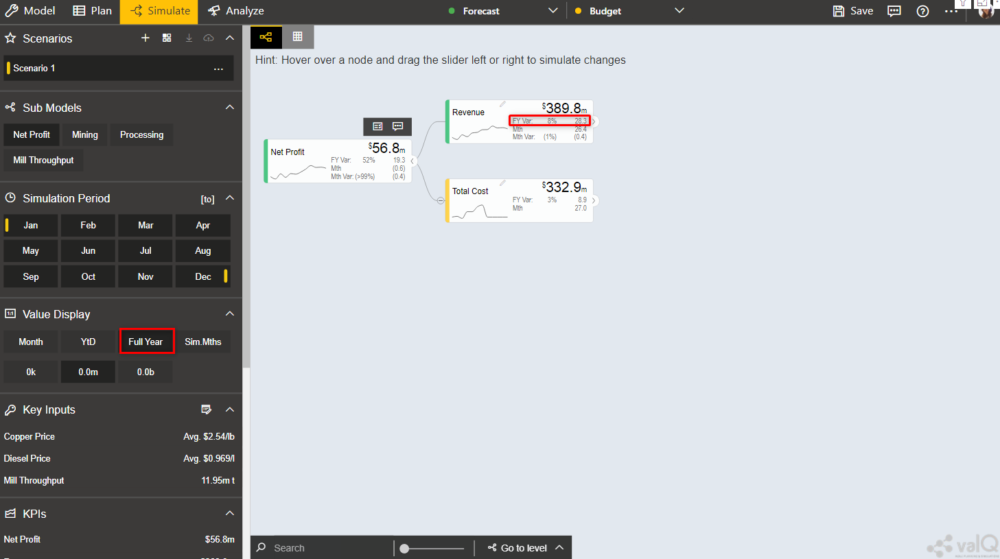

    Value Display

The time aggregation and display relates to the Simulation Period
selected.

When **Month** is selected, it shows the first month of the simulation
interval selected. By default, the simulation period is the selected
period and the future. This is an important concept as when we simulate,
we generally don’t want to apply a change to the past as we can’t change
it. It is possible to also set the ‘to’ period in a simulation, and highlight the month you want as the end period of a
simulation. This is however a special scenario.

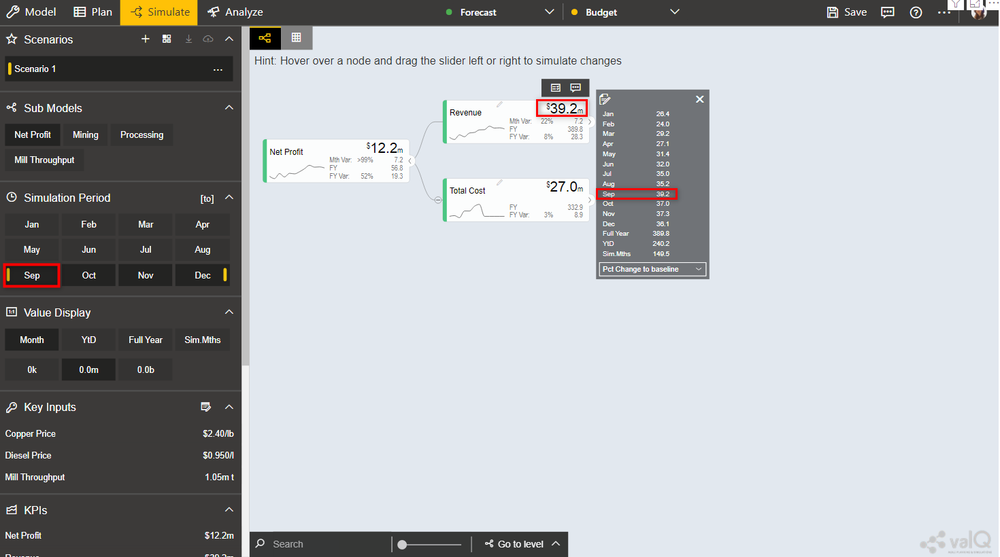

    Simulation Period

**YTD** – the selected period -1 is the year to date data (eg. selected
simulation period is September to December, the YTD data will be from
Jan to August).

Note: Simulation of future periods will not impact the YTD data.

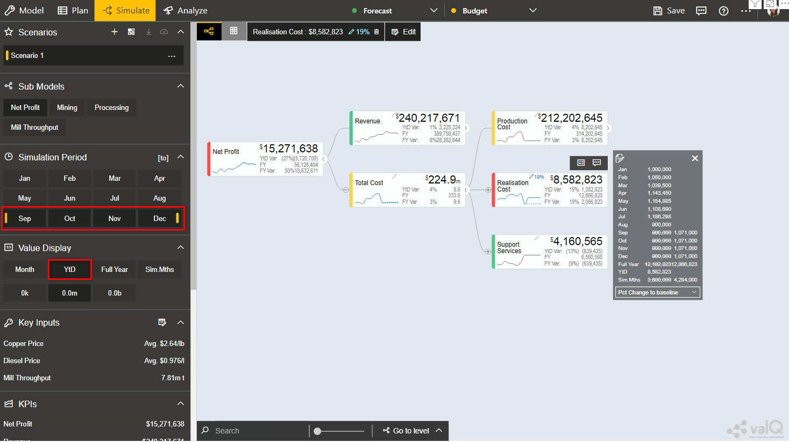

    Value Display and Simulation Period

**Full Year** – Shows the full year cumulated data

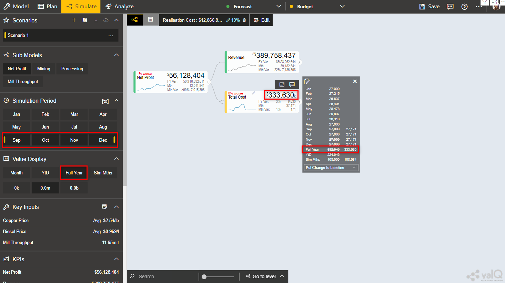

    Value Display and Simulation Period

**Sim. Period** – to simulate a specific period, for example a 3 month
rolling forecast from September to November, click the first month
September then click |..image::_static/image15|\ and click the last month November for
simulation. You can then choose to only show the values aggregated for
the selected simulation periods

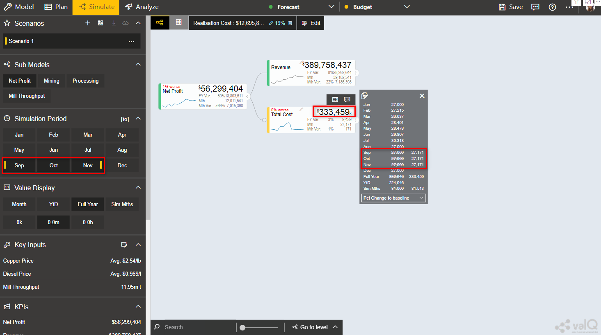

    Value Display and Simulation Period

As part of the New Release, you will be able to view the Tooltip for all the Value Displays. 
For our example, the Tooltip for the Month Value Display is shown in the below Figure.

.. figure:: _static/vd1.png
    :align: center
    :alt: alternate text

    Tooltip for Month Value Display

Similarly you can view the Tooltip for other Value Displays.

Sub Models - Filters
--------------------

If your Value Driver Tree is large, the designer may have defined
specific sub views. These would be listed under the Sub Models Section
of the Navigation Panel. When clicking on one of these views, the tree
will be filtered and the specific node will be made the top node.
Calculation dependencies are still respected but this significantly
improves the navigation as it focuses the tree on a specific area.

In this example, the options defined are:

-  Open all company level: Net Profit

-  Open per department: Mining, Processing or the operational tree for
   Mill Throughput

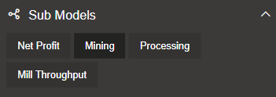

    Sub Models – Filters

KPIs
----

The Navigation Panel can be configured to list a set of KPI’s from the
value driver tree. You are able to navigate to each of them for a fast
view on the simulation impact on a given KPI. Click on the KPI to
navigate to the node.

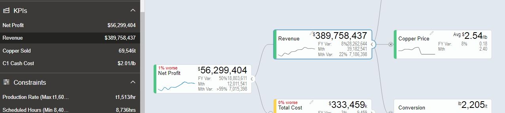

    KPIs

Data Simulation
---------------

There are 2 options to simulate:

-  Hover over a desired node to simulate, slide the scaling button to
   right for positive impact or left for negative impact. The simulation
   will be showed on the right hand side. A window will open displaying
   the changes. The pencil icon will display the change in percentage
   that has been made: |..image::_static/image19|, and a legend with percentage showing
   if the adjust has made the scenario better or worse |..image::_static/image20|.

.. figure:: _static/4.13.png
    :align: center
    :alt: alternate text

    Data Simulation

-  Click on the arrow icon of the node |..image::_static/image22| then click ‘Edit Key
   Input’ |..image::_static/image23| and manually edit the changes in simulation per
   period. Click X to close manual input table.

Notes

-  You can update the periods highlighted in YELLOW based on the
   selected simulation period.

.. figure:: _static/4.14.png
    :align: center
    :width: 1000
    :alt: alternate text

    Simulation Periods

The edit icon will indicate the months that have been edited.

.. figure:: _static/4.15.png
    :align: center
    :width: 1000
    :alt: alternate text

    Simulation Periods

-  You can update the ‘Variation’ column which will overwrite the
   numbers in the selected simulation periods. Any manual updates in
   period will not be overwritten by the ‘Variation’ column. In the
   example below, in blue are the months which were manually edited and
   in orange are highlighted the variation and in this case the month to
   which the variation was applied.

.. figure:: _static/4.16.png
    :align: center
    :width: 1000
    :alt: alternate text

    Simulation Periods

Click reset icon to return to the original data |..image::_static/image27|.

As part of the New Release, you can simulate the Node having "0" as the value. When the slider is moved to the right end, it will show positive values and when the 
slider is moved to the left end, it will show negative values. The property of the Simulation remains the same for the Change Percentage,
Manual, Growth Percentage and Constant options.

.. figure:: _static/zero1.png
    :align: center
    :width: 1000
    :alt: alternate text

    Simulated Node having "0" as values

From the above Figure, you can observe that the Growth Percentage has been selected as an option.

Key Inputs 
-----------

Key Inputs is available on the left side panel to directly simulate key
cost drivers without going into the node details.

Click the ‘Edit Key Input’ icon |..image::_static/image28| and manually edit the changes
in simulation per periods.

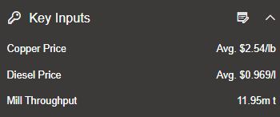

    Key Inputs

Notes:

-  Can update the periods highlighted in YELLOW based on the selected
   simulation period. All the changes in the Key Assumptions are
   highlighted in the left side panel side.

.. figure:: _static/4.18.png
    :align: center
    :width: 1000
    :alt: alternate text

    Simulation Periods

Click X to close manual input table.

-  Click a Key Assumption or Key Performance Indicator and it will
   highlight the source nodes to further check the details.

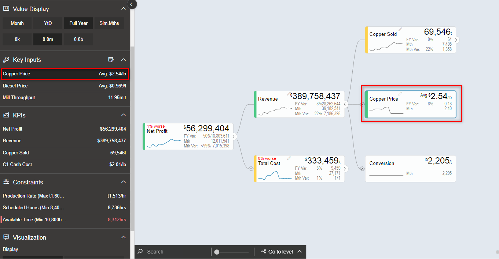

    Key Inputs

All simulations are highlighted in the upper right corner.

|..image::_static/image32|

Click |..image::_static/image33| to return to the original selected version without any
simulation.

When more number of simulations are done, you will be able to view the Show More button in the upper right corner. By clicking
the Show More button, you will be able to see the remaining simulations as shown in the below Figure.

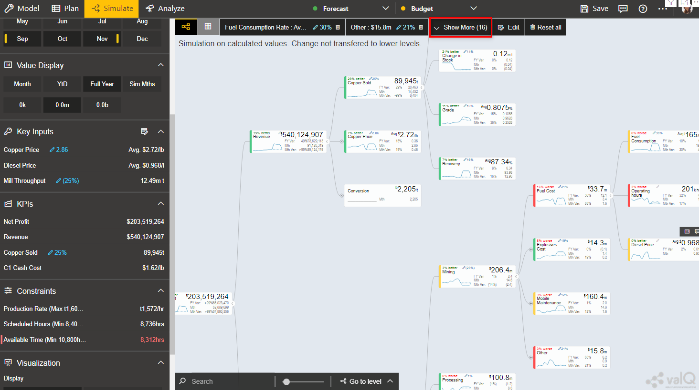

    Simulations - More option button

Scenarios Functionality 
------------------------

You can create multiple scenarios in parallel, compare them as well as
sharing the collection with others.

This is how you do it.

-  Create a Scenario 1 by clicking the “+” button in the Navigation
   Panel (see Figure below).

.. figure:: _static/sf1.png
    :align: center
    :alt: alternate text

    Create Scenario

-  You can view the Context Drop Down Menu as shown in the below Figure.

.. figure:: _static/sf2.png
    :align: center
    :alt: alternate text
    
    Context Drop Down Menu

-  After clicking the Context Drop Down Menu, you will be able to view
   the Menu items such as Copy Scenario, Edit and Delete Functions (see
   Figure below).

.. figure:: _static/sf3.png
    :align: center
    :alt: alternate text

    Context Drop Down Menu Items

-  When you click the “Copy Scenario” Menu Item, you will be able to
   create the Scenario 2 with the same configuration as done for
   Scenario 1.

.. figure:: _static/sf4.png
    :align: center
    :width: 1000
    :alt: alternate text

    Scenario 1

The above Figure shows the settings for Scenario 1. When you click the
“Copy Scenario” Menu Item, you will be able to view the Scenario 2 being
created with the same set of configuration done for Scenario 1 (see
Figure below).

.. figure:: _static/sf5.png
    :align: center
    :width: 1000
    :alt: alternate text

    Scenario 2

The copied scenario is the replicate of the last scenario (e.g. Scenario
2 will have the same data from the copied Scenario 1.

-  By clicking the “Edit” Menu Item, you will be able to edit the
   Scenario (see Figure below).

.. figure:: _static/sf6.png
    :align: center
    :alt: alternate text

    Scenario 1 Edit

From the above Figure, you can observe that you will be able to edit the
labels for the Title and Description for the selected Scenario.

-  By clicking the “Delete” Menu Item, you will be able to delete the
   entire Scenario.

-  Click ‘Create a new Scenario and make it the active scenario’ icon as shown below

.. figure:: _static/sfi1.png
    :align: center
    :alt: alternate text

    Create a new Scenario and make it the active scenario icon   

This will create a new Scenario and will highlight the created Scenario as the active scenario.

-  Click ‘Compare Scenario’ icon to generate a report comparison format with the key Assumptions and KPI’s (see Figure below).

.. figure:: _static/sfi2.png
    :align: center
    :alt: alternate text

    Compare Scenario icon

-  Comparison report compares all scenarios that have been created in
   the active collection. It also shows the Simulated Data Scenario
   (Baseline: Full Year), Comparison Version (Full Year) and Simulated
   Data Scenario Year to Date (Baseline: YTD).

-  From the below Figure, the GREEN fonts denotes the most favorable
   results and the RED fonts denotes the least favorable result in the
   scenario comparison report.

.. figure:: _static/sf7.png
    :align: center
    :width: 1000
    :alt: alternate text

    Full Year Scenario Comparison

As part of the New Release, you will be able to download the excel file of the compared scenarios based on your choice by clicking the "Download to Excel" option
in the Scenario Comparison screen as shown below. 

.. figure:: _static/scom1.png
    :align: center
    :width: 1000
    :alt: alternate text

    Download option in Scenario Comparison screen 

You can select the Scenario and download the excel file as shown in the below Figure.

.. figure:: _static/scom2.png
    :align: center
    :alt: alternate text

    Scenario selection

-  You have the option to make additional simulation in the new scenario
   or click the icon appearing in the top most right pane to
   return to the original selected version without any simulation and
   then make a new simulation (see Figure below).

.. figure:: _static/sfi3.png
    :align: center
    :alt: alternate text

    Reset All icon 

-  Click the Download icon located in the Scenarios Section to extract the report in xml format (see Figure below).

.. figure:: _static/sfi4.png
    :align: center
    :alt: alternate text

    Download icon 

-  Click the icon for write back functionality (see Figure below). By clicking 
   this option you will be able to write back/post valQ data to a
   configured URL in the server.

.. figure:: _static/sfi5.png
    :align: center
    :alt: alternate text

    Write back icon 

By clicking the Configure URL to write back the current scenario option, you will be able to select any one among the two different options to write back the current scenario   
to the configured URL in the server (see Figure below).

.. figure:: _static/wb1.png
    :align: center
    :width: 300
    :alt: alternate text

    Write back options 

-  The created Scenarios can be reordered based on our choice by a
   simple drag and drop options. For our example, you have reordered the
   Scenarios as shown in the below Figure.

.. figure:: _static/sf9.png
    :align: center
    :alt: alternate text

    Reordered Scenarios

Based on the reordered scenarios, you will be able to view the
Comparison Report with the similar reordered hierarchy as shown in the
below Figure.

.. figure:: _static/sf10.png
    :align: center
    :width: 1000
    :alt: alternate text

    Comparison Report with reordered Scenarios

Constraints
-----------

Constraints are also available in the left side panel that identifies
the metrics that are overcapacity (highlighted in RED fonts) or still
have opportunities for further improvements (WHITE fonts).

Notes:

-  RED fonts means over capacity as compared to the maximum limit. (e.g.
   Production Rate 1.681 tonnes per hour is over capacity as compared to
   the maximum limit of 1.600 tonnes per hour).

-  WHITE fonts means still have opportunities for improvement as
   compared to the maximum limit.

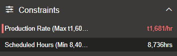

    Constraints

.. figure:: _static/4.24.png 
    :align: center
    :alt: alternate text

    Constraints

Visualization
-------------

Visualization is available in the left side Navigation panel which helps the users view the Tree in the Table or Tree format based on their choice.
By using the View Mode, the user can select three different view modes namely Full, Standard and Minimal to view the 
Tree or Table Format.

The below Figure represents the Tree View Format with the View Mode being selected as "Full". Here you can observe that the 
Nodes will be displayed in Full mode.

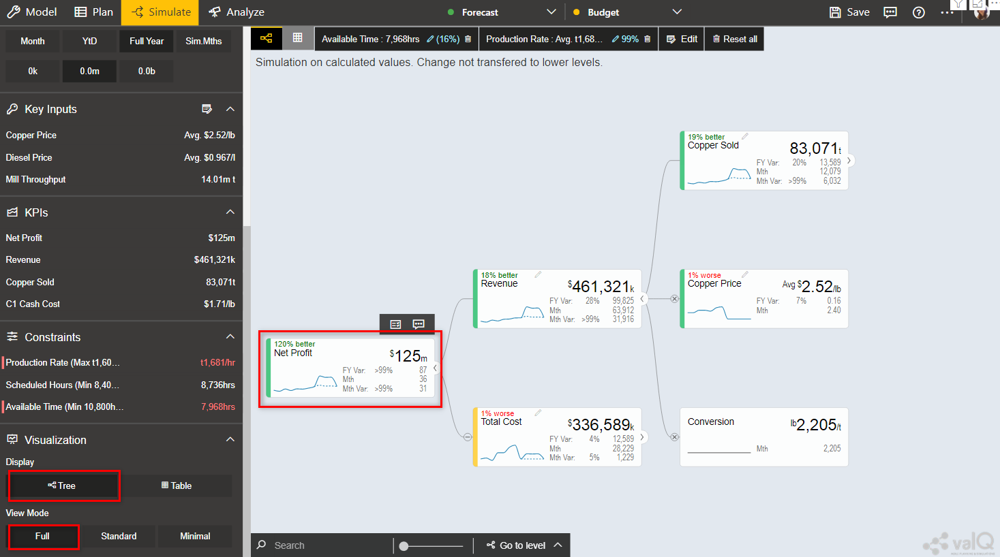

    Visualization - Display as Tree and View Mode selected as Full

The below Figure represents the Table View Format with the View Mode being selected as "Standard". Here you can observe that the 
Table view will show the Primary value, Comparison value, Variance and Variance % values for the Full Year. 

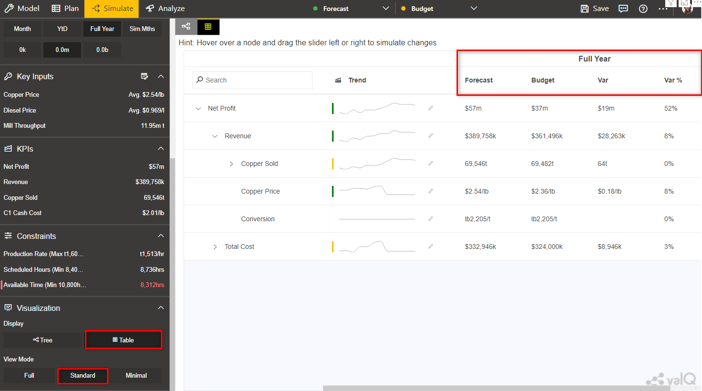

    Visualization - Display as Table and View Mode selected as Standard 

When the View Mode is selected as "Full", then you will be able to view the Table with Primary value, Comparison value, Variance and Variance % values for the Full Year and also the same set of values for the Month.

When the View Mode is selected as "Minimal", then you will be able to view only the Primary value and Comparison value for the Full Year.

Contextual Help Information
---------------------------

As part of the New Release, the Contextual Help Information feature has been included in the Advance Editor window by which the user can be 
directed to the specific help page. For our example, navigate to the Settings Tab and click the 
Navigation Panel. You can view the Contextual Help Information icon (see Figure below). 

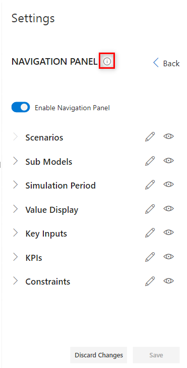

    Icon for Contextual Help Information 

By clicking the Contextual Help Information icon, you will be redirected to the Help Information page for the Navigation Panel.

Understanding Variances
=======================

The starting point for a simulation is a selection of two versions -
**Primary Version** and a **Comparison Version** and a year. For
instance a forecast vs current budget.

Once we start simulating, changes are applied to the primary version. We
call this changing version the Simulation.

To understand the improvements we achieve, we also keep track of the
original values from the primary version without simulation changes. We
therefore have 3 data series in the model that we calculate and compare:

1. Simulation (The Primary Version including applied variations)

2. Original (The Primary Version without variations)

3. Target (The Comparison Version)

Based on the above, we calculate the following variances:

-  Simulated Variance (Simulation vs Target)

Q: If we changed these things, would we hit target?

-  Simulation Impact (Simulation vs Original)

Q: How much would we improve if we made these changes?

-  Original Variance (Original vs. Target)

Q: What was our variance if we did nothing?

Understanding the Node Widget Information
=========================================

The Node Widget for a Value Driver displays key information such as
value, variance, simulation impacts and trend without having to navigate
further.

.. figure:: _static/6.1.png
    :align: center
    :width: 1000
    :alt: alternate text

    Node Widget Information

Conducting what-if analysis
===========================

One of the main aspects of the valQ Custom Visual is to be able to
simulate the impacts changes to key drivers such as prices have on the
full year forecast. As we can’t change the past, such a simulated change
should only be applied to future period. The valQ Custom Visual have
this capability. When performing what-if analysis, the period that a
simulation should be applied from is selected in the Side Panel (current
period is default):

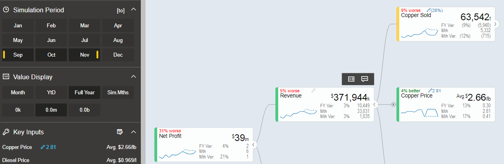

    What-if-Analysis

Assuming that we calculate fuel cost based on litre per month and price
as $/l and we are at the end of period 9, the simulated cost should be
calculated first at the monthly level with the % change applied to
period 9 and onwards. Once the individual months are calculated, they
can then be aggregated based on the rule of the node (sum for diesel
cost, weighted average for diesel price):

.. figure:: _static/formula.png
    :align: center
    :alt: alternate text

When hovering over a node, the bottom half of the node becomes a slider.
Drag the slider left to vary the node by a negatively, drag right for
positive. As you drag, the values for the selected node is dynamically
recalculated and displayed. When releasing, the tree will immediately
recalculate all dependent nodes and show the result.

.. figure:: _static/7.2.png 
    :align: center
    :alt: alternate text

    Simulation

A simulation change is either a pct. Change, a fixed future price or a
pct. Growth depending on the simulation model defined for the value
driver.

The default method for the driver can be seen on the simulation tooltip.
You can also change the selected model by selecting at the bottom of the
tooltip.

.. figure:: _static/7.3.png 
    :align: center
    :alt: alternate text

    Simulation Tooltip

Understanding that a change is applied to the selected periods only is
particularly important to understand when displaying the Full Year value
and the node is using a weighted average. The displayed value is the
weighted average value for the full year, not the value for future
periods.

A simplified example will help understanding this critical concept.
Let’s assume that the diesel price is $1.014 for all periods and the
monthly fuel consumption is constant as well at 1m litres and we have
selected period 9 as we want to apply the simulation to the remaining
periods of the year.

We now drag the slider for the fuel price to the right and the node will
show the new weighted average value. Let’s say we drag it to the right
so the full year weighted average is $1.030. As the first 8 periods were
$1.014, the weighted average of $1.030 means that the simulated price
change is equivalent of a future fuel price of $1.20. To better
understand the individual future period simulations when looking a Full
Year aggregated number, it is useful to pay attention to the Month Data
also shown on the node. The real world is a little more complex as the
price is not necessarily the same every month and the fuel consumed is
unlikely to be constant as well. Below is an example of such a
simulation based on a real data set:

.. figure:: _static/7.4.png 
    :align: center
    :alt: alternate text

    Simulation

The weighted average price was 1.014. We now simulated a 2% increase in
the prices selected and future periods which equates to a new weighted
average price of 1.030. If you look at the month Value, you can see for
the selected month, this equates to the higher price of 1.195.

Multiple variations can be applied in parallel as they are expressed as
pct. The top left % indicate the cumulative impact on this particular
node of all simulation that impacts it.

Any node with a variation will have the blue pen icon in the top middle
showing the percentage the node has been varied with. For quick what-if
analysis at any level and a dynamic work process from the general to the
specific, you can apply a simulation on any level.

Certain nodes may have been locked from changes in the model. This is
generally when there is a specific reason not to vary this node directly
for consistency purposes. A locked node will not have the grey pen icon
|..image::_static/image48|\ or a slider when hovering.

Certain nodes may be displayed multiple times in the tree. An example is
Material Moved as it affects Mining and Mill Throughput. In these
scenarios, one node is linked to the other. If you simulate a change in
a linked node, the node it is pointing to is instead changed so it
applies both to the selected node and anywhere else where the driver is
used. If a node is a linked node, it has the Linked node text in the
bottom right corner:

.. figure:: _static/7.5.png 
    :align: center
    :alt: alternate text

    Simulation

Getting more information about a Value driver
=============================================

If you click on a node Widget, a Pop up screen is displayed with
additional information on the selected node.

.. figure:: _static/8.1.png
    :align: center
    :width: 1000
    :alt: alternate text

    Information on Value Driver

For some nodes, the designer may have added a description beyond the
title. If so, this will be displayed below the title.

If a node is calculated, a simplified version of the formula is
displayed. This is the technical formula that is used to calculate
individual period values. To calculate the real values, all simulation
variations that affects the node are applied to selected and future
periods and the aggregation rules for the node is applied (sum or
weighted average).

The trend chart compares the simulated value to the comparison version
as well as showing the original value as the dotted line on the bar if
simulation variations are active. If you hover over the bar, you will
the see the details for the period.

The table on the top right shows the period and full year values and the
variance calculations as per the definition previously in this document.

The valQ Custom Visual also analyses all the active simulations to see
if any impacts this particular node. If so, it then analyses how much
each of the active simulation changes contributes to the overall impact
on this node and generates a waterfall diagram with the break down which
is displayed in the bottom right panel.

In some scenarios, you may vary multiple factors impacting the same node
in a compound nature. I.e. you vary both sales volume and sales price
and want to know the impact on revenue. As the sum of both changes is
more than the impact of each individually, the waterfall chart breaks
down each of the individual impacts and a compound impact bar.

As part of the latest Release, you will be able to view the Value Display Tooltip by hovering the mouse over the Trend Chart Area
in the Pop up screen (see Figure below). Also you can view the data labels for the X Axis. The values representing the loss status will be in Red 
color and the values representing the gain status will be in Green color as shown in the below Figure.

.. figure:: _static/12.25a.png 
    :align: center
    :width: 1000
    :alt: alternate text

    Pop up screen Display

For more details on Pop up screen, you can refer the link: https://valq.com/blogs/video-valq-pop-up-screen-nodes 

Saving and Opening Scenarios 
=============================

The standard valQ Custom Visual template contains functionality for
saving and opening a scenario collection.

When clicking the Edit button |..image::_static/image51| , you will be asked to provide a
Scenario Title Name.

.. figure:: _static/9.1.png
    :align: center
    :alt: alternate text

    Scenario Title Name

You will be also able to delete the existing scenario from there using
the Delete button |..image::_static/image53|.

There is also an option to export the value driver tree data set to xml.
It will create an unformatted spreadsheet with the tree and all the node
data.

Workspace in ValQ 
=============================
ValQ Workspace is an account provisioned for a dedicated set of users - to help them utilize collaborative features of the product such as saving scenarios, commenting, viewing history logs and managing users. You can setup and manage your workspace by following the below instructions.

1. Creating a workspace
------------------------
You can create a workspace when you visit the ValQ.com website followed by signing up for the enterprise trial or purchasing ValQ from the shop.
At this point, you should also specify the number of users you plan to add to this workspace. The workspace name given here cannot be modified.

.. figure:: _static/W.1.png
    :align: center
    :alt: alternate text

Upon creation, you will be assigned as the workspace admin by default, and a link to the workspace admin console is shared to your e-mail address.
As an admin. you can invite relevant users into the workspace for collaboration. Workspace members can utilize the features of the product, as per the pricing plan selected.

.. figure:: _static/W.2.png
    :align: center
    :alt: alternate text

2. Inviting other users to the workspace
-----------------------------------------
You can invite other users to the workspace from the Admin Console. After signing up and logging in at the admin portal, you can go to the 'User Manager' section, click 'Add Members' and fill in the users' email address to extend the invitation to the workspace.
The invited members would receive an email notification. The members can sign into ValQ using the 'Login' button.

.. figure:: _static/W.4.png
    :align: center
    :alt: alternate text

3. Assigning roles for the workspace users
-------------------------------------------
As an admin, you can choose between 'Member' and 'Admin' as roles for the users in the workspace. You can also remove any users, if needed. This is available at the 'User Manager' section in the admin console.

.. figure:: _static/W.5.png
    :align: center
    :alt: alternate text

4. Choosing a workspace
------------------------
If you are an user with access to multiple workspaces, you can choose between these workspaces during the login at the ValQ custom visual.

If you are an admin managing different workspaces, you can also choose between workspaces during the login. Additionally, you can select or switch between these workspaces at the profile dropdown within Admin Console.

.. figure:: _static/W.6.png
    :align: center
    :alt: alternate text

5. Workspace for pricing plans
-----------------------------------
You can utilize the advantages of having a workspace by purchasing our 'Teams Pricing' or adding multiple users to our 'Per User Pricing'.

For example, our Professional plan under Teams Pricing comes with a discounted price for 25 users or more.
You would have to fill-in the Workspace name while purchasing a plan. Upon successful purchase, all the 25 or more users will be able to access the workspace.

.. figure:: _static/W.7.png
    :align: center
    :alt: alternate text

.. |visualBI_final| image:: media/image1.png
   :width: 2.30208in
   :height: 0.88542in
.. |..image::_static/image2| image:: media/image2.png
   :width: 7.08194in
   :height: 4.01458in
.. |4| image:: media/image3.jpeg
   :width: 5.90625in
   :height: 3.61458in
.. |..image::_static/image4| image:: media/image4.png
   :width: 0.14583in
   :height: 0.17708in
.. |..image::_static/image7| image:: media/image7.png
   :width: 1.26656in
   :height: 0.19667in
.. |..image::_static/image8| image:: media/image7.png
   :width: 1.26656in
   :height: 0.19667in
.. |..image::_static/image9| image:: media/image8.png
   :width: 2.81215in
   :height: 1.11444in
.. |..image::_static/image10| image:: media/image9.png
   :width: 7.08194in
   :height: 4.00833in
.. |..image::_static/image11| image:: media/image10.png
   :width: 0.25in
   :height: 0.23958in
.. |..image::_static/image12| image:: media/image11.png
   :width: 7.08194in
   :height: 3.97639in
.. |..image::_static/image13| image:: media/image12.png
   :width: 7.08194in
   :height: 3.13681in
.. |..image::_static/image14| image:: media/image13.png
   :width: 7.08194in
   :height: 3.22778in
.. |..image::_static/image15| image:: media/image10.png
   :width: 0.25in
   :height: 0.23958in
.. |..image::_static/image16| image:: media/image14.png
   :width: 7.08194in
   :height: 3.09583in
.. |..image::_static/image17| image:: media/image15.png
   :width: 2.79132in
   :height: 1.02071in
.. |..image::_static/image18| image:: media/image16.png
   :width: 7.08194in
   :height: 1.87431in
.. |..image::_static/image19| image:: media/image17.png
   :width: 0.28125in
   :height: 0.29167in
.. |..image::_static/image20| image:: media/image18.png
   :width: 0.5625in
   :height: 0.25in
.. |..image::_static/image22| image:: media/image20.png
   :width: 0.1875in
   :height: 0.16667in
.. |..image::_static/image23| image:: media/image21.png
   :width: 0.16667in
   :height: 0.1875in
.. |..image::_static/image27| image:: media/image25.png
   :width: 0.21875in
   :height: 0.21875in
.. |..image::_static/image28| image:: media/image26.png
   :width: 0.16665in
   :height: 0.18748in
.. |..image::_static/image29| image:: media/image27.png
   :width: 2.68716in
   :height: 1.18735in
.. |C:\Users\GANESH~1\AppData\Local\Temp\SNAGHTMLa5e88063.PNG| image:: media/image29.png
   :width: 7.00759in
   :height: 3.51042in
.. |..image::_static/image32| image:: media/image30.png
   :width: 2.31221in
   :height: 0.31246in
.. |..image::_static/image33| image:: media/image31.png
   :width: 0.14581in
   :height: 0.1354in
.. |..image::_static/image34| image:: media/image32.png
   :width: 0.21872in
   :height: 0.14581in
.. |..image::_static/image35| image:: media/image33.png
   :width: 6.63459in
   :height: 3.08295in
.. |..image::_static/image36| image:: media/image34.png
   :width: 0.35417in
   :height: 0.20833in
.. |..image::_static/image37| image:: media/image35.png
   :width: 0.21872in
   :height: 0.16665in
.. |..image::_static/image38| image:: media/image36.png
   :width: 0.17706in
   :height: 0.1354in
.. |..image::_static/image39| image:: media/image37.png
   :width: 7.08194in
   :height: 3.42222in
.. |..image::_static/image41| image:: media/image39.png
   :width: 2.82292in
   :height: 0.97917in
.. |6| image:: media/image41.jpeg
   :width: 7.07292in
   :height: 3.65625in
.. |..image::_static/image44| image:: media/image42.png
   :width: 7.08194in
   :height: 2.85347in
.. |7| image:: media/image43.jpeg
   :width: 4.09375in
   :height: 1.91667in
.. |..image::_static/image48| image:: media/image46.png
   :width: 0.19792in
   :height: 0.13542in
.. |8| image:: media/image48.jpeg
   :width: 7.08194in
   :height: 3.98194in
.. |..image::_static/image51| image:: media/image49.png
   :width: 0.21872in
   :height: 0.19789in
.. |..image::_static/image52| image:: media/image50.png
   :width: 3.43707in
   :height: 2.6455in
.. |..image::_static/image53| image:: media/image51.png
   :width: 0.18748in
   :height: 0.15623in
.. |..image::_static/image54| image:: media/image52.png
   :width: 0.20833in
   :height: 0.19231in
.. |..image::_static/image55| image:: media/image53.png
   :width: 0.17708in
   :height: 0.17708in
.. |..image::_static/image56| image:: media/image54.png
   :width: 7.08194in
   :height: 3.30625in
.. |..image::_static/image57| image:: media/image55.png
   :width: 7.08194in
   :height: 3.29722in
.. |..image::_static/image58| image:: media/image56.png
   :width: 7.08194in
   :height: 3.39097in
.. |..image::_static/image59| image:: media/image57.png
   :width: 6.90625in
   :height: 4.96147in
.. |..image::_static/image60| image:: media/image58.png
   :width: 7.08194in
   :height: 3.42639in
.. |..image::_static/image61| image:: media/image59.png
   :width: 2.66597in
   :height: 5.02083in
.. |..image::_static/image62| image:: media/image60.png
   :width: 4.34375in
   :height: 3.64192in
.. |..image::_static/image63| image:: media/image61.png
   :width: 7.08194in
   :height: 3.24931in
.. |..image::_static/image64| image:: media/image62.png
   :width: 7.08194in
   :height: 4.00694in
.. |C:\Users\GANESH~1\AppData\Local\Temp\SNAGHTML95dcd268.PNG| image:: media/image63.png
   :width: 6.50377in
   :height: 3.66038in
.. |..image::_static/image66| image:: media/image64.png
   :width: 2.75in
   :height: 3.59891in
.. |..image::_static/image67| image:: media/image65.png
   :width: 6.07292in
   :height: 3.72426in
.. |..image::_static/image68| image:: media/image66.png
   :width: 4.28555in
   :height: 3.59375in
.. |..image::_static/image69| image:: media/image67.png
   :width: 7.08194in
   :height: 4.00139in
.. |..image::_static/image70| image:: media/image68.png
   :width: 4.25in
   :height: 3.55574in
.. |..image::_static/image71| image:: media/image69.png
   :width: 4.20365in
   :height: 3.54167in
.. |..image::_static/image72| image:: media/image70.png
   :width: 7.08194in
   :height: 3.76458in
.. |..image::_static/image73| image:: media/image71.png
   :width: 7.08194in
   :height: 3.68819in
.. |..image::_static/image74| image:: media/image72.png
   :width: 3.8934in
   :height: 3.25in
.. |..image::_static/image75| image:: media/image73.png
   :width: 6.25795in
   :height: 3.22639in
.. |..image::_static/image76| image:: media/image74.png
   :width: 3.68627in
   :height: 4.40625in
.. |..image::_static/image77| image:: media/image75.png
   :width: 7.08194in
   :height: 3.99583in
.. |..image::_static/image78| image:: media/image76.png
   :width: 7.08194in
   :height: 3.99722in
.. |..image::_static/image79| image:: media/image77.png
   :width: 3.47938in
   :height: 2.95008in
.. |..image::_static/image80| image:: media/image78.png
   :width: 5.79813in
   :height: 4.35661in
.. |C:\Users\GANESH~1\AppData\Local\Temp\SNAGHTMLba665f5.PNG| image:: media/image79.png
   :width: 4.0625in
   :height: 3.04352in
.. |..image::_static/image82| image:: media/image78.png
   :width: 2.03125in
   :height: 2.65625in
.. |..image::_static/image83| image:: media/image80.png
   :width: 6.70694in
   :height: 3.88056in
.. |..image::_static/image84| image:: media/image81.png
   :width: 3.75319in
   :height: 3.67708in
.. |..image::_static/image85| image:: media/image82.png
   :width: 7.08194in
   :height: 4.00625in
.. |..image::_static/image86| image:: media/image83.png
   :width: 7.08194in
   :height: 3.29722in
.. |..image::_static/image87| image:: media/image84.png
   :width: 7.08194in
   :height: 3.28125in
.. |..image::_static/image88| image:: media/image85.png
   :width: 7.08194in
   :height: 3.525in
.. |..image::_static/image89| image:: media/image86.png
   :width: 7.08194in
   :height: 3.09097in
.. |..image::_static/image90| image:: media/image87.png
   :width: 4.29613in
   :height: 3.59375in
.. |..image::_static/image91| image:: media/image88.png
   :width: 4.45313in
   :height: 3.75in
.. |..image::_static/image92| image:: media/image89.png
   :width: 7.08194in
   :height: 4.03542in
.. |..image::_static/image93| image:: media/image90.png
   :width: 7.08194in
   :height: 4.03056in
.. |..image::_static/image94| image:: media/image91.png
   :width: 4.58276in
   :height: 3.89535in
.. |..image::_static/image95| image:: media/image92.png
   :width: 7.08194in
   :height: 3.98889in
.. |..image::_static/image96| image:: media/image93.png
   :width: 4.19429in
   :height: 3.44792in
.. |..image::_static/image97| image:: media/image94.png
   :width: 7.08194in
   :height: 4.02639in
.. |..image::_static/image98| image:: media/image95.png
   :width: 7.08194in
   :height: 4.00833in
.. |..image::_static/image99| image:: media/image96.png
   :width: 7.08194in
   :height: 4.06042in
.. |..image::_static/image100| image:: media/image97.png
   :width: 5.17221in
   :height: 1.625in
.. |..image::_static/image101| image:: media/image98.png
   :width: 5.08333in
   :height: 1.72568in
.. |..image::_static/image102| image:: media/image99.png
   :width: 3.95314in
   :height: 3.33333in
.. |..image::_static/image103| image:: media/image100.png
   :width: 4.2054in
   :height: 3.53125in
.. |..image::_static/image104| image:: media/image101.png
   :width: 7.08194in
   :height: 3.96181in
.. |..image::_static/image105| image:: media/image102.png
   :width: 7.08194in
   :height: 4.05208in
.. |..image::_static/image106| image:: media/image103.png
   :width: 7.08194in
   :height: 4.01181in
.. |..image::_static/image107| image:: media/image104.png
   :width: 7.08194in
   :height: 1.71042in
.. |..image::_static/image108| image:: media/image105.png
   :width: 2.51042in
   :height: 5.21734in
.. |..image::_static/image109| image:: media/image106.png
   :width: 7.08194in
   :height: 4.05625in
.. |..image::_static/image110| image:: media/image107.png
   :width: 2.34375in
   :height: 6.9482in
.. |..image::_static/image111| image:: media/image108.png
   :width: 7.08194in
   :height: 4.02986in
.. |..image::_static/image112| image:: media/image109.png
   :width: 2.56915in
   :height: 5.23958in
.. |..image::_static/image113| image:: media/image110.png
   :width: 7.08194in
   :height: 3.33889in
.. |..image::_static/image114| image:: media/image111.png
   :width: 2.39583in
   :height: 5.7632in
.. |..image::_static/image115| image:: media/image112.png
   :width: 7.08194in
   :height: 4.06389in
.. |..image::_static/image116| image:: media/image113.png
   :width: 2.28516in
   :height: 7.03831in
.. |..image::_static/image117| image:: media/image114.png
   :width: 7.08194in
   :height: 4.025in
.. |..image::_static/image118| image:: media/image115.png
   :width: 6.64094in
   :height: 3.27033in
.. |..image::_static/image119| image:: media/image116.png
   :width: 7.08194in
   :height: 4.03056in
.. |..image::_static/image120| image:: media/image117.png
   :width: 7.08194in
   :height: 3.93611in
.. |..image::_static/image121| image:: media/image118.png
   :width: 2.26458in
   :height: 9.81806in
.. |..image::_static/image122| image:: media/image119.png
   :width: 7.08194in
   :height: 3.99028in
.. |..image::_static/image123| image:: media/image120.png
   :width: 7.08194in
   :height: 3.93542in
.. |..image::_static/image124| image:: media/image121.png
   :width: 7.08194in
   :height: 3.93194in
.. |..image::_static/image125| image:: media/image122.png
   :width: 6.97917in
   :height: 3.92963in
.. |..image::_static/image126| image:: media/image123.png
   :width: 2.34536in
   :height: 4.85499in
.. |..image::_static/image127| image:: media/image124.png
   :width: 7.08194in
   :height: 3.99792in
.. |..image::_static/image128| image:: media/image125.png
   :width: 2.4349in
   :height: 5.83566in
.. |..image::_static/image129| image:: media/image126.png
   :width: 7.08194in
   :height: 3.99792in
.. |..image::_static/image130| image:: media/image127.png
   :width: 2.5538in
   :height: 4.0625in
.. |..image::_static/image131| image:: media/image128.png
   :width: 7.08194in
   :height: 3.525in
.. |..image::_static/image132| image:: media/image129.png
   :width: 2.08905in
   :height: 5.4474in
.. |..image::_static/image133| image:: media/image130.png
   :width: 7.08194in
   :height: 3.9625in
.. |..image::_static/image134| image:: media/image131.png
   :width: 3.00341in
   :height: 1.85724in
.. |..image::_static/image135| image:: media/image131.png
   :width: 3.5245in
   :height: 1.25111in
.. |..image::_static/image136| image:: media/image131.png
   :width: 3.27752in
   :height: 1.92063in
.. |..image::_static/image137| image:: media/image132.png
   :width: 7.08194in
   :height: 3.98125in
.. |..image::_static/image138| image:: media/image131.png
   :width: 2.66026in
   :height: 2.71066in
.. |..image::_static/image139| image:: media/image131.png
   :width: 2.87005in
   :height: 2.02208in
.. |..image::_static/image140| image:: media/image131.png
   :width: 2.5347in
   :height: 2.93203in
.. |..image::_static/image141| image:: media/image131.png
   :width: 2.75138in
   :height: 2.44786in
.. |..image::_static/image142| image:: media/image131.png
   :width: 2.71702in
   :height: 2.45061in
.. |..image::_static/image143| image:: media/image131.png
   :width: 2.11442in
   :height: 3.2169in
.. |..image::_static/image144| image:: media/image133.png
   :width: 7.08194in
   :height: 3.93819in
.. |..image::_static/image145| image:: media/image134.png
   :width: 7.0625in
   :height: 3.525in
.. |..image::_static/image146| image:: media/image135.png
   :width: 7.08194in
   :height: 4.11667in
.. |..image::_static/image147| image:: media/image136.png
   :width: 7.08194in
   :height: 2.86667in
.. |..image::_static/image148| image:: media/image137.png
   :width: 1.95in
   :height: 4.0581in
