Model Tab
##############

The Model tab has two panels in which the left panel represents the Advanced Editor and the right panel 
denotes the canvas which represents the Value Driver Tree visuals (see Figure below).

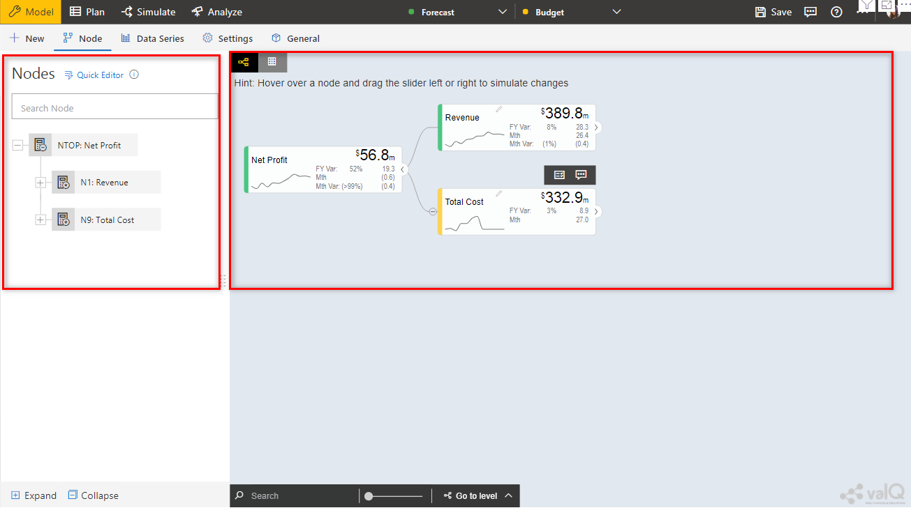
 
    Left Panel and Right Canvas

The Model tab has five different Tab options (see Figure below).  

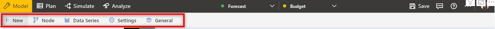
 
    Tab option for the Model tab

The Tab options for the Model tab has been listed below:

1. New Tab – To configure the design for the Value Driver Tree using the
   options such as Sample Demo Tree, Create a Simple Dynamic Tree,
   Import an Advanced Tree and Create a New value driver tree from the
   scratch.

2. Node Tab – To configure the settings of Nodes and Child Nodes for the
   Value Driver Tree

3. Data Series Tab – To configure the data settings such as Data Series Manager, Time Aggregation Labels
   and Data Sorting.

4. Settings Tab – To configure the settings parameters such as Navigational Panel, Nodes, Canvas, Number Formatting, Conditional Formatting and Color Theme.
   
5. General Tab – To configure the General settings such as License Registration, Export and Writeback functions.
   
In the next sections, you will be able to understand on how to design a value driver tree 
using these five different Tab categories in detail. 

As an initial step, follow the below steps to configure the design for
the value driver tree in Power BI.

1. Navigate to the “Visualizations Panel” and “Fields” Panel in Power BI
   (see Figure below).

.. figure:: _static/11.1.png
    :align: center
    :width: 1000
    :alt: alternate text

    Power BI with Visualizations and Fields Panel

2. In the Visualizations Panel, select the valQ Custom Visual and extend
   the screen to its full view as shown in the Figure below.

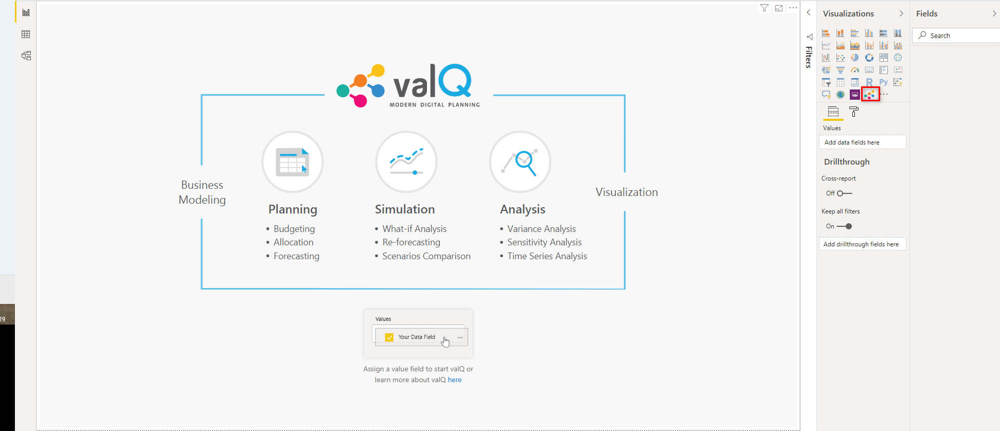

    valQ Screen - Measures to be assigned

3. To create a value driver tree (valQ) in Power BI, it is mandatory to
   assign a Data Source to the value driver tree. For our example, a
   data source (sample data shown below) has been assigned to the value
   driver tree.

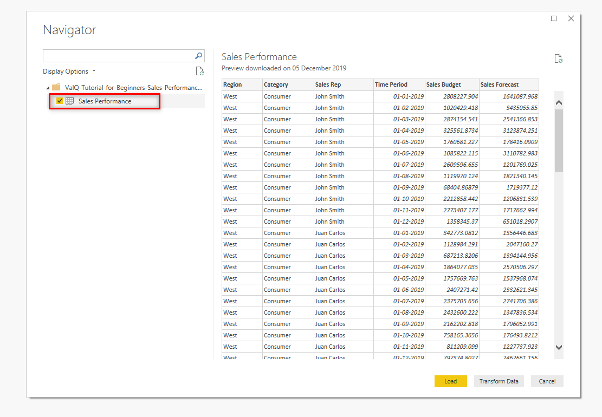

    Sample Data

4. Now at least one Measure Value has to be assigned to the property
   “Values” in Visualizations panel. In our example, we have assigned
   the Measure Value “∑ Actual” to the property “Values” by clicking the
   check box option against the Measure Value “∑ Actual” (see Figure
   below).

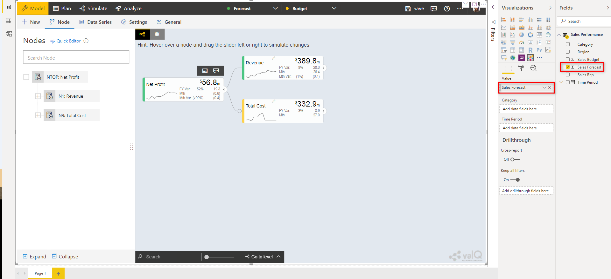

    Assigning the Measure Value

New Tab
=======

The Value Driver Tree can be created in Power BI using the below listed
options by clicking the New Tab in the left panel (see Figure below)

-  Open a Sample Model

-  Create a Simple Model 

-  Create an Advanced Model 

-  Import an Advanced Model

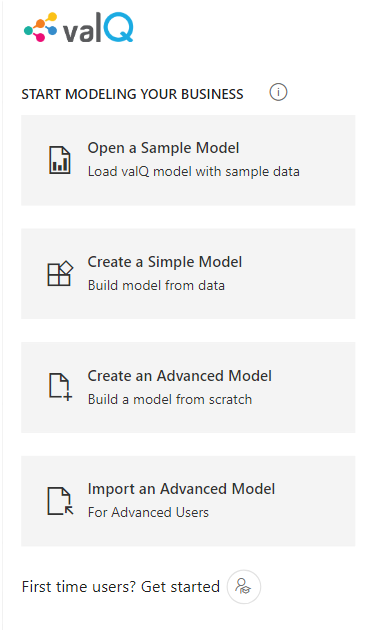

    New Tab

.. _OSM:

Open a Sample Model
-------------------

Click the “New” Tab in the left panel. Now navigate to the Open a Sample
Model option. You will be able to explore a Demo Tree. By clicking the
Open a Sample Model option, you will be able to view the Loading sample screen as shown below and also you 
can search for the specific sample to get loaded (see Figure below).

.. figure:: _static/12.2a.png
    :align: center
    :alt: alternate text

    Loading screen

For our example, the sample “Mining Industry” has been selected.

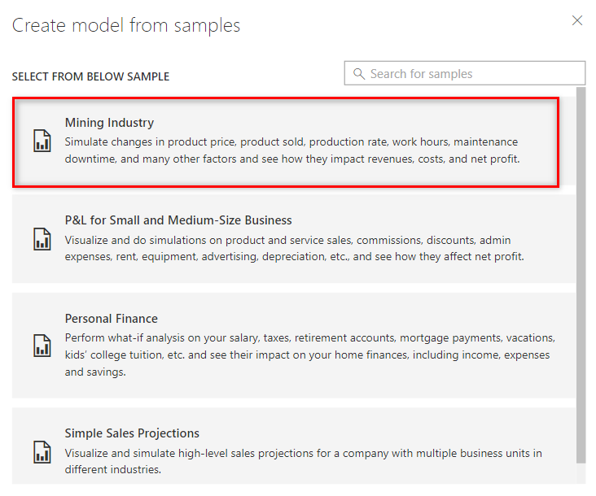

    Selection of sample model

Based on the selection, you will be able to view the valQ screen as shown
below. As part of the latest Release, each Node in the Advance Editor panel will be having an Icon 
which represents the Node Type. 

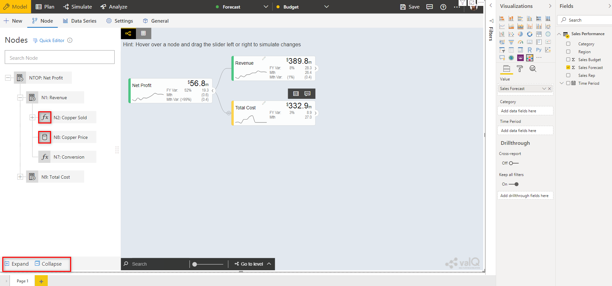

    valQ screen with Nodes settings

The Nodes hierarchy will be displayed in the Advance Editor option as
shown in the above Figure. Here you will be able to add number of child
nodes from the parent node “Net Profit”. By clicking the Parent Node,
you will be able to add number of child nodes as shown below. Also you
will be able to expand, collapse and delete the entire Nodes Hierarchy
using the options “Expand”, “Collapse” and “Delete” (see Figure above).

As part of the New Release, the "Lock" and "Unlock" options have been included in the 
Advance Editor for the Node Tab (see Figure below). By clicking the lock option, you will not 
be able to edit the configuration done for the Node (see Figure below).

.. figure:: _static/lck1.png
    :align: center
    :width: 1000
    :alt: alternate text

    Lock option in Node Tab

By clicking the Unlock option, you will be able to edit the configuration done for the Node (see Figure below).

.. figure:: _static/lck2.png
    :align: center
    :width: 1000
    :alt: alternate text

    Unlock option in Node Tab

By providing the Node Name in the Search option on the right canvas, you
will be able to search for the particular Node when there are more
number of nodes appearing on the right canvas.

.. figure:: _static/12.4.png
    :align: center
    :width: 1000
    :alt: alternate text

    Node Search option in right canvas

For our example, the Node name is given as “Operating Hours” and based
on the search you will be able to view the Node as shown in the Figure
below.

.. figure:: _static/12.5.png
    :align: center
    :width: 1000
    :alt: alternate text

    Display of the Searched Node

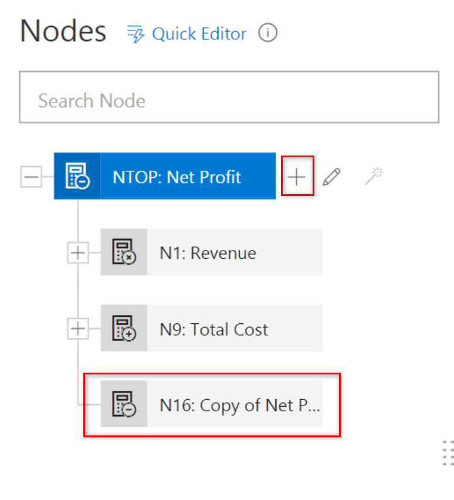

    Nodes Structure with Add option

In the above Figure, you can observe that by clicking the “+” button, a
Node “Copy of Net Profit” has been added. Similarly you can edit the
Parent Node details by clicking the Edit button as shown below. For our
example, the Edit button has been clicked.

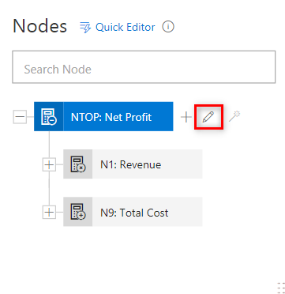

    Nodes Structure with Edit option

By clicking the Edit option you will be able to view the Edit Settings
for the Node. The Edit Settings are categorized as follows:

1. General

2. Configuration

3. Display

4. Simulation

5. Business Definition

6. Conditional Formatting 

7. Secondary KPI

General
~~~~~~~

In General settings you will be able to configure the Node details such
as Unique ID, Title and the Title Prefix when outside the Tree with the
values as shown in the below Figure. The Title Prefix can be set at Node
Level and during simulation it is useful to identify at which node the
parameter value changes. The additional properties of the Node Tab has
been listed in Section 13.2.

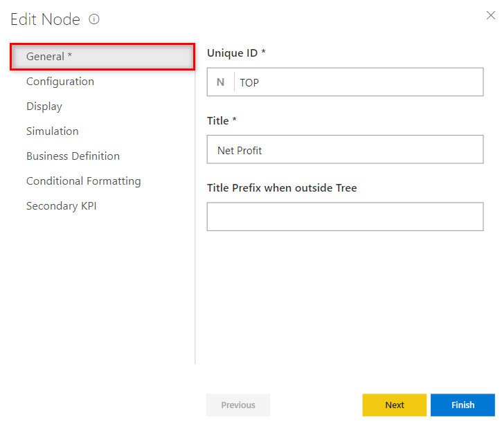

    Edit Node – General Settings

Based on the above configuration, you will be able to view the valQ
screen as shown below.

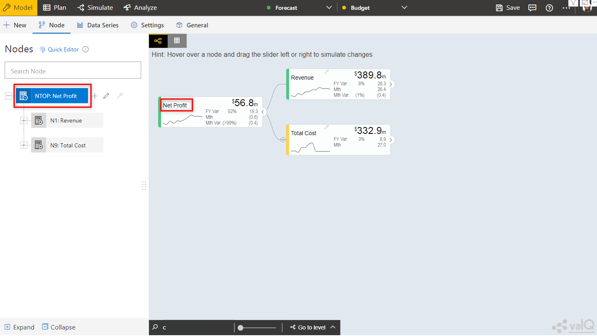

    valQ screen with General settings

From the above Figure, you can observe that the Unique ID for the Parent
Node is “TOP” and the Title of the Parent Node is “Net Profit”.

In our other example as shown below, we have configured the Title Prefix
for two different Nodes (see Figures below).

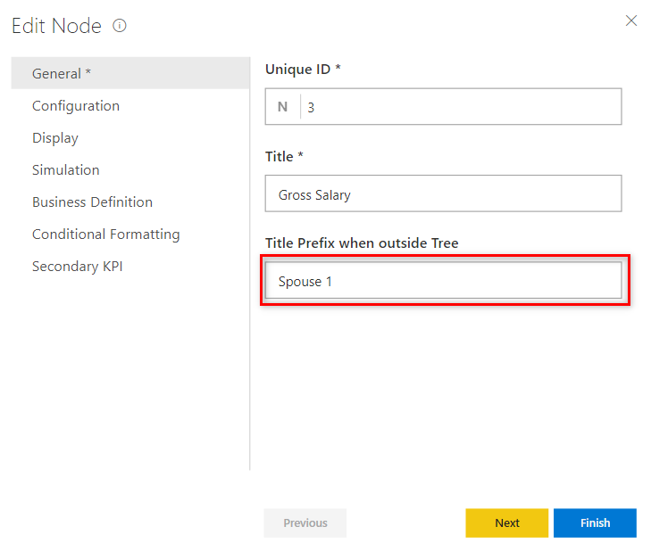

    Node with Prefix value as Spouse 1

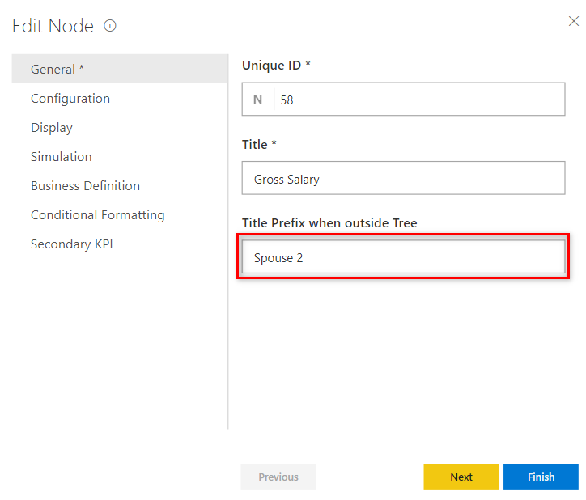

    Node with Prefix value as Spouse 2

Based on the above set of configurations, you will be able to view the
valQ screens as shown below.

.. figure:: _static/12.12.png
    :align: center
    :width: 1000
    :alt: alternate text

    valQ screen with Spouse 1 Prefix

.. figure:: _static/12.13.png
    :align: center
    :width: 1000
    :alt: alternate text

    valQ screen with Spouse 2 Prefix

From the above two Figures you can observe that the “Gross Salary” is
the common Title for two different Nodes. In order to differentiate
them, we have provided the value for “Title Prefix when outside the
Tree” as Spouse1 for one Node and Spouse 2 for the other Node. After
simulation, you can see which Node’s value has been changed.

Configuration 
~~~~~~~~~~~~~~

In Configuration Settings, you will be able to configure the Node
details such as Calculation Method, Time Aggregation, Desired Trend and
Value Range with the values as shown in the below Figure.

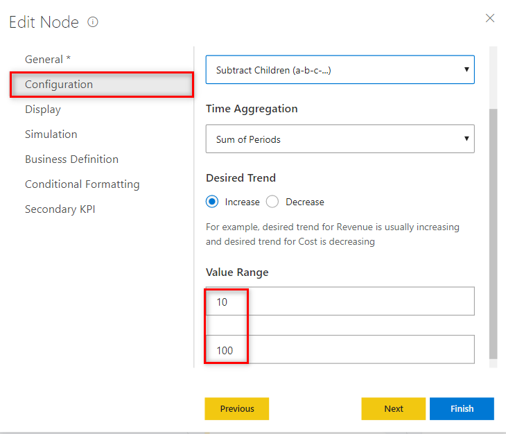

    Edit Node – Configuration Settings

Based on the above Configuration settings, you will be able to view the
valQ screen as shown in the below Figure.

.. figure:: _static/12.15.png
    :align: center
    :width: 1000
    :alt: alternate text

    valQ with Configuration settings

From the above Figure you can observe that in the Navigation Panel, the
value that is displayed in the Constraints section will lie in the range
from minimum 10 to maximum 100 for a specific month based on the
configuration done for the Value Range. In our example, the calculation
method is selected as 'Subtract Children (a-b-c)' meaning that from the first child
node the other child nodes will get subtracted and its result will be displayed in the Parent Node. The
Time Aggregation is set to Sum of Periods where we have considered 12
months as period. As the result of simulation, each Node will display
the values based on the Sum of Periods. Also the “Desired Trend” has
been set to the Increase option. When simulated, the desired Trend for
the Revenue will be increasing and the value for the Total Cost will be
decreasing.

For the Calculation Method being selected as 'Data Source', you can follow the steps as explained in the following link : https://valq.com/blogs/3-methods-of-mapping-valq-nodes-to-data/

For other options of calculation method, you can refer the link: https://valq.com/blogs/assigning-values-to-nodes-in-valq/

On selecting 'Formula' and clicking on the formula field, you will be able to see a dropdown of the formulas that are supported. For a list of formulas that are available in valQ, you can refer to the link :doc:`Functions`

**Template Nodes** 

Also you can create a Template Node for the already existing Node. It
is very specific that the Template Nodes should not map the Parent
Node. You need to select the particular Node and copy a Node under the
selected Node for creating the Template Node.

In the below Figure as an example, you can observe that a copy of
Revenue Node has been created by the right click copy and paste actions.
Now the copied Revenue Node version is labelled as “Revenue 2” in
General Property of the Edit Node Window (see Figure below).

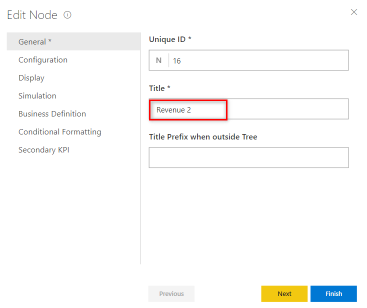

    Edit Node: Copy of Revenue Node labelled as Revenue 2

Now navigate to the Configuration property of the Edit Node Window. Set
the Calculation Method to the option Template based on the node. Also
set the Node to use as Template to the option 1:Revenue (see Figure
below).

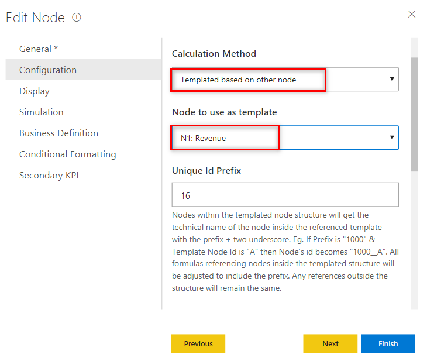

    Edit Node: Calculation Method selected as Template based on other node and Revenue Node to be used as Template

Based on the above configuration, you will be able to view the Templated
Node Revenue 2 having all its Nodes similar to the Revenue Node as per
our example.

.. figure:: _static/13.5.png
    :align: center
    :width: 1000
    :alt: alternate text

    Templated Node

Display 
~~~~~~~~

In the Display Settings, you will be able to configure the Node Display
settings such as Node Display, Scale, Value Decimal Places, Value
Prefix, Value Suffix and Details on Click with the
values as shown in the below Figure.

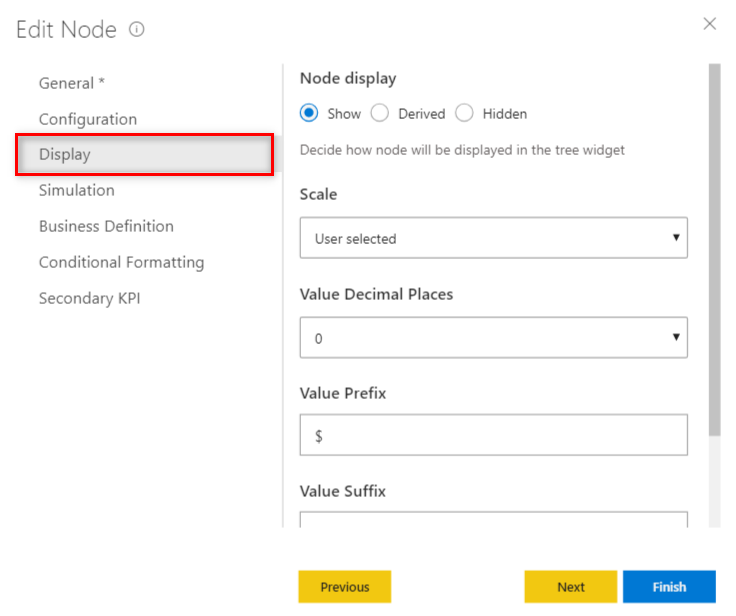

    Edit Node – Display Settings

Based on the above Display settings, you will be able to view the valQ
screen as shown in the below Figure.

.. figure:: _static/12.17.png
    :align: center
    :width: 1000
    :alt: alternate text

    valQ with Display settings

From the above Figure, you can observe that the Node Display is set to
“Show” option. The Scale has been set to the User Selected option and
now you can edit the Scaling options in the Value Display under Settings
Tab. When the Scale is set to other options you will not be able to edit
the Scaling options in the Value Display. You can also view the Nodes
with the values configured with Value Decimal Places as “0”, Value
Prefix as “$” and Value Suffix as “r”. 

Since the Details on Click option is enabled in the Display settings,
you can observe the Pop up screen being displayed after clicking the Node
“Net Profit” (see Figure below). If the Details on Click option is
disabled in the Display settings, then you will not be able to view the
Pop up screen.

.. figure:: _static/12.18.png
    :align: center
    :width: 1000
    :alt: alternate text

    Pop up screen

**Composite Node Display**

A Node in a tree can now be added with a maximum of two composite nodes which can be taken from any nodes. 
For our example, the below Figure shows the Tree structure with several nodes.

.. figure:: _static/cnd1.png
    :align: center
    :width: 1000
    :alt: alternate text

    Tree with several nodes 

For our example, two child nodes from the Node “Total Cost” needs to be included as composite nodes to the 
Node “Revenue”. For adding the composite nodes, go to the configuration settings window of the Node “Revenue” 
by clicking the Edit and Configure Node option (see Figure below).

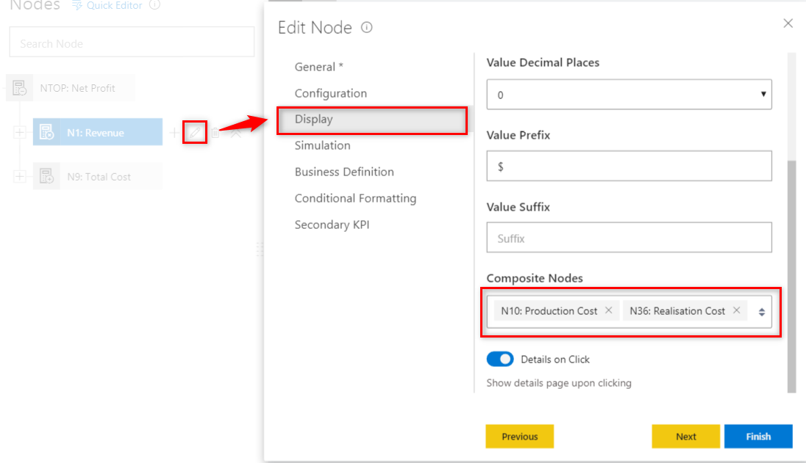

    Adding Composite Nodes 

In the Edit Node panel, go to the Display settings and add the Nodes “10:Production Cost” and 
“36: Realisation Cost” as Composite Nodes to the Node Revenue (see Figure above). Now the Tree 
structure will get configured based on the above settings (see Figure below).

.. figure:: _static/cnd3.png
    :align: center
    :width: 1000
    :alt: alternate text

    Tree with composite nodes

You can observe that the Nodes “10:Production Cost” and “36: Realisation Cost” have been added as the 
composite nodes to the node “Revenue”. Also when a simulation is done in the actual 
Nodes (10:Production Cost” and “36: Realisation Cost), the similar simulation will get reflected in the 
composite nodes and it is vice versa (see Figure below).

.. figure:: _static/cnd4.png
    :align: center
    :width: 1000
    :alt: alternate text

    Composite Node with simulated values

The composite nodes will have no effect in the Table view structure of the Tree. 
In the Quick Editor screen, you can view the composite node ids in a separate column by enabling 
the composite node option from the “selected columns” drop down menu (see Figure below).

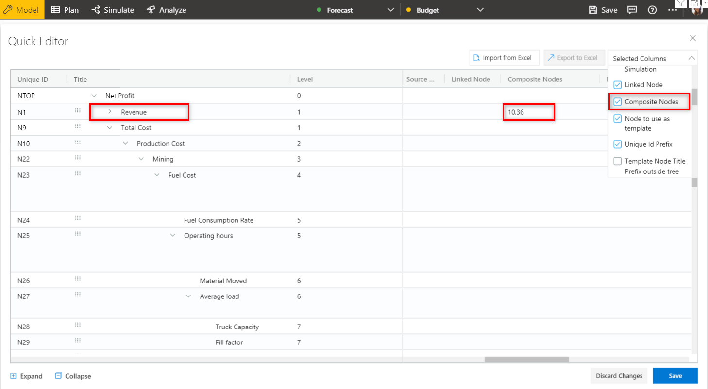

    Quick Editor with composite node id display

Simulation
~~~~~~~~~~

In the Simulation Settings, you will be able to configure Simulation details such as selection 
of Default Simulation Method and assigning the Node for the Linked Simulation (see Figure below). 
You have the option to enable/disable the Simulation function for the Node (see Figure below).

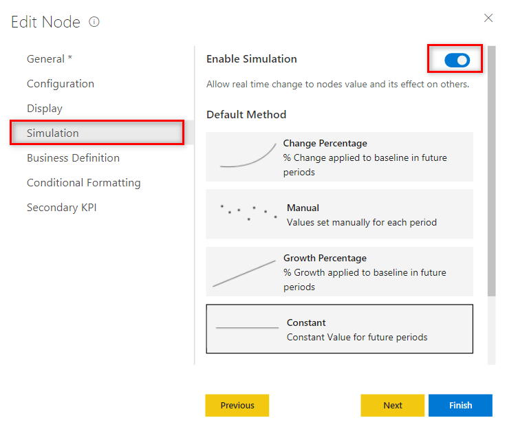

    valQ with Simulation Settings

In this Simulation Settings, you have selected the Default Method as
“Constant" for the Simulation and you have selected the Node for the
Linked Simulation as “First Node” (see Figure above). Based on the above
settings you will be able to view the valQ page as shown in the Figure
below. The other options for the Default Simulation Method are Change
Percentage, Manual and Growth Percentage.

.. figure:: _static/12.20.png
    :align: center
    :width: 1000
    :alt: alternate text

    valQ screen with Constant value selection

From the above Figure, you will be able to view the pop window as shown
in the above screen by clicking the Arrow icon in the Net Profit Node as
shown in the Figure below.

.. figure:: _static/12.21.png
    :align: center
    :alt: alternate text

    Net Profit Node

Now click the Edit option in the pop window as shown in the Figure
below.

.. figure:: _static/12.22.png
    :align: center
    :width: 1000
    :alt: alternate text

    Edit option

By clicking the Edit option, you will be able to view and edit the input
values for the Simulation Period (see Figure below).

.. figure:: _static/12.23.png
    :align: center
    :width: 1000
    :alt: alternate text

    Edit Inputs for Simulation Periods

For our example, the value for March month has been edited and as a
result it gets reflected for all the Nodes.

Business Definition
~~~~~~~~~~~~~~~~~~~

Using this option, you will be able to configure the Business Definition
details such as Description, Header, Footer and Technical Notes with the
values as shown in the below Figure.

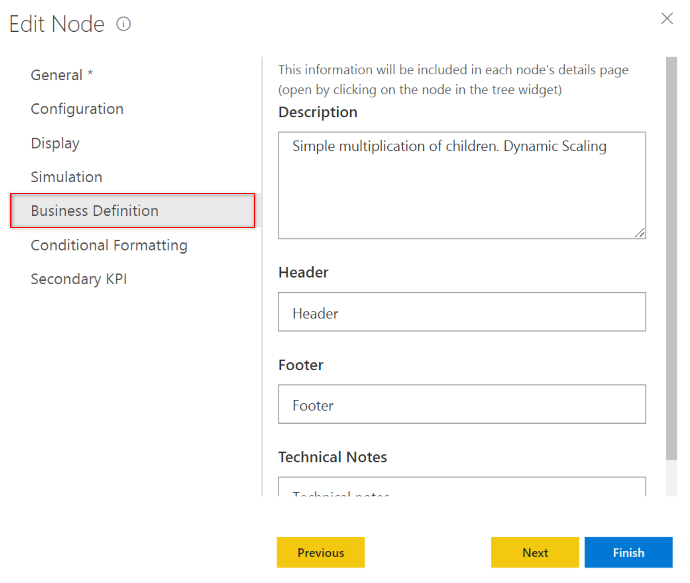

    valQ with Business Definition Settings

Based on the above settings, you will be able to view the Business
Definitions details in the Pop up screen as shown below.

.. figure:: _static/12.25.png
    :align: center
    :width: 1000
    :alt: alternate text

    Pop up screen with Business Definitions

Conditional Formatting
~~~~~~~~~~~~~~~~~~~~~~

Using the Conditional Formatting option, you will be able to apply the Alert Thresholds and Rules at the specific Node Level (see Figure below). For our example, the Node "Revenue"
has been selected.

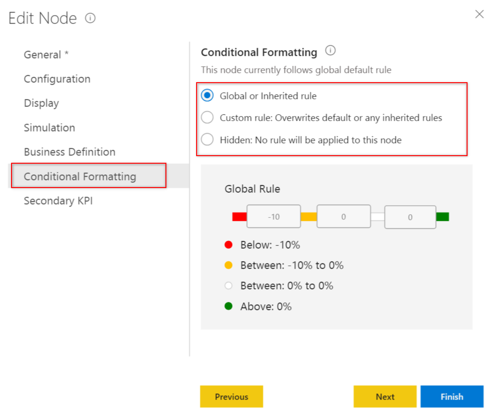

    Conditional Formatting Settings for Node

In the Conditional Formatting settings for the Node "Revenue", you have 3 different options as highlighted in the above Figure. 

When the option "Global or Inherited Rule" is selected, then the Conditional Formatting Rules configured as Global Level in the Settings Tab  
will be applied here.

Now set the option as "Custom Rule: Overwrites default or any inherited rules" as shown in the below Figure.

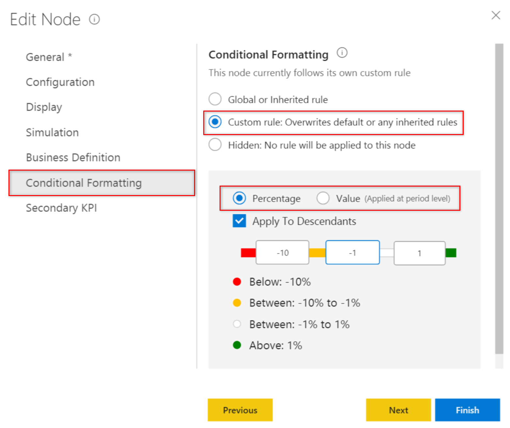

    Conditional Formatting Settings for Node - Custom Rule option with Percentage selection

The Custom Rule option can be configured based on variance percentage values and the values applied at period level (see Figure above). 

For our first example, set the option for the Custom Rule as "Percentage" and also enable the property "Apply to Descendants". Set the Threshold values as shown in the above Figure.
After simulation, you can find that the Variance percentage value for the Node "Revenue" falls in the Threshold range (4%)* which is between -10% to -1% and based on that condition, the status bar for the Node Revenue is yellow color (see Figure below).

.. figure:: _static/cfn3.png
    :align: center
    :width: 1000
    :alt: alternate text

    Custom Rule option with Percentage value selection for the Node "Revenue"

Also you can observe that the Descendant Node "Copper Price" has been updated with the same Threshold settings based on our configuration. 
The Variance percentage value for the Descendant Node "Copper Price" falls in the Threshold range (8%)* which is Above 1% and based on that condition, the status bar for the Descendant Node "Copper Price" is green color (see Figure below).

.. figure:: _static/cfn4.png
    :align: center
    :width: 1000
    :alt: alternate text

    Custom Rule option with Percentage value selection for the Descendant Node "Copper Price"

For our second example, set the option for the Custom Rule as "Value (applied at Period Level) - see Figure below.

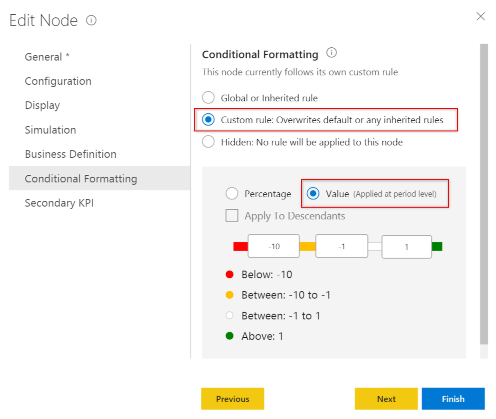

    Custom Rule option with value selection for the Node "Revenue"

Set the Threshold values as shown in the above Figure. After simulation, you can find that the 
Metric value for the Node "Revenue" falls in the Threshold range (522.3)* which is Above 1 
and based on that condition, the status bar for the Node Revenue is green color (see Figure below).

.. figure:: _static/cfn6.png
    :align: center
    :width: 1000
    :alt: alternate text

    Custom Rule option with Value selection for the Node "Revenue"

**Note:**
"*" denotes that the Metric values get calculated based on the Period Level. For example when it is a Year, it will take the value of 12 being multiplied with the range value that we provide.

Now set the option to "Hidden: No Rule will be applied to this Node". You can observe that no range values can be provided for the Conditional Formatting and since there will be no status color for that Node being simulated. 

Secondary KPIs
~~~~~~~~~~~~~~~~~~~~

Secondary KPIs helps user to aggregate and visualize additional or alternate KPI values in the node widget. 
Specifically, in a model with two data series, these are the set of secondary metrics captured under the primary value of the node

.. figure:: _static/SecKPI.1.png
    :align: center
    :width: 1000
    :alt: alternate text

As a default, there are three secondary values displayed for a dual series data in the following order
i. Full Period Variance between baseline and comparison metric (in % and absolute values)
ii.	Baseline metric value for the first period in the series 
iii. Variance for the first period between baseline and comparison metric (in % and absolute values) 

.. figure:: _static/SecKPI.2.png
    :align: center
    :width: 1000
    :alt: alternate text

Secondary KPI option lets users to customize these secondary values or metric according to their preference 

Users can achieve this using:
I.	Secondary KPI option based on Formulas
II.	Secondary KPI option based on Template

I.	Secondary KPI option based on Formulas

In the below model screenshot, the user can display the data value from Operating Profit %’ and ‘Operating Expense Ratio’ as Secondary KPI values to the TOP node ‘Operating profit’.

.. figure:: _static/SecKPIF.1.png
    :align: center
    :width: 1000
    :alt: alternate text

Under the 'Operating Profit' node setting's 'Secondary KPI' ribbon, user needs to select the 'Formula' button and fill-in the label name and the custom formula for his additional Secondary KPIs

.. figure:: _static/SecKPIF.2.png
    :align: center
    :width: 1000
    :alt: alternate text

.. figure:: _static/SecKPIF.3.png
    :align: center
    :width: 1000
    :alt: alternate text

Upon completing, the user can see ‘Operating Profit %’ and ‘Ops Expense Ratio’ values displayed as Secondary KPI values to ‘Operating profit’

.. figure:: _static/SecKPIF.4.png
    :align: center
    :width: 1000
    :alt: alternate text

II.	Secondary KPI option based on Template

In the model, user can display ‘Contribution’ of each of the child nodes Water, Beverages, and Others to their parent node Gross Profit. 
User should define ‘Contribution’ as a Formula in one of the nodes and call them out for ‘Contribution’ calculation using the Template option at the other nodes.

.. figure:: _static/SecKPIT.1.png
    :align: center
    :width: 1000
    :alt: alternate text

In this example, user can define the formula in 'Water' node under the node setting's Secondary KPI by selecting 'Formula' button and defining the 'Custom Formula'
Upon completion, 'Contribution %' is displayed as a Secondary value of the node widget.

.. figure:: _static/SecKPIT.2.png
    :align: center
    :width: 1000
    :alt: alternate text

To borrow this formula on other nodes, user can fo into the Secondary KPI setting of the 'Beverages' node, select the 'Template' button, and choose to display the same formula as the 'Water' node.
User can instantly see the corresponding 'Contribution %' at the 'Beverage' node.

.. figure:: _static/SecKPIT.3.png
    :align: center
    :width: 1000
    :alt: alternate text

Similarly, following the same steps for the 'Other' node helps the user to instantly visualize ‘Contribution %’ for the all the child nodes to Gross Profit

.. figure:: _static/SecKPIT.4.png
    :align: center
    :width: 1000
    :alt: alternate text

Create a Simple Model
---------------------

Using this option, it is very simple for the beginners to create a tree
automatically based on their own data source. By clicking the Create a
Simple Model option, you will be able to view the valQ screen as shown 
in the below Figure.

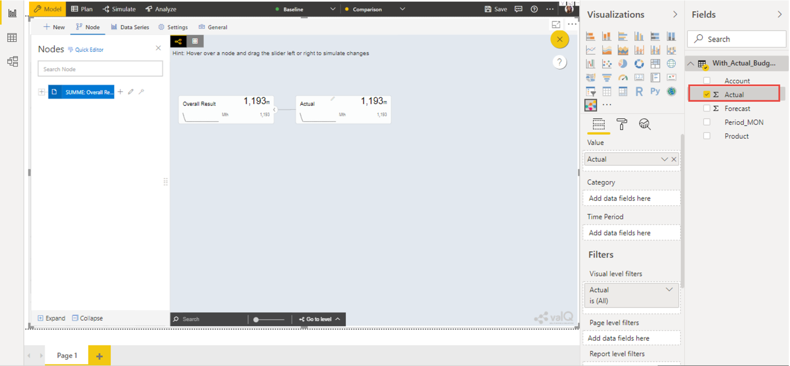

    Simple Dynamic Tree created with one single Measure

By default, the Measure “Actual” has been selected as a Mandatory
criteria for getting the Tree widget. Now you can select the other
Measures and Dimensions based on your choice as indicated in the Figure
below.

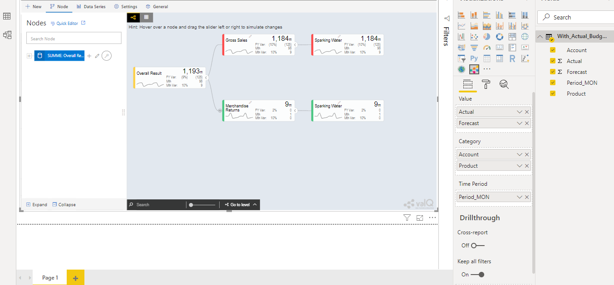

    Simple Dynamic Tree created with Measures and Dimensions

From the above Figure, you can observe that the other Measure “Forecast”
is assigned to “Value” and the Dimensions namely Account and Product has
been assigned to the “tab” and the Period_MON is assigned to “Time
period”. Now based the assigned data source, the Tree is being
configured. Hence now you can create a tree directly from your data. For
step by step instructions on how to get started to build a Dynamic
Model, please follow this link:
`https://ValQ.com/wp-content/uploads/ValQ-for-microsoft-power-bi-beginners-tutorial.pdf <https://valq.com/wp-content/uploads/valq-for-microsoft-power-bi-beginners-tutorial.pdf>`__.

**Note**: For Dynamic Model, you will be able to view the Root Node and
first three Nodes in the next level hierarchy under the Sub Models
section of the Navigation Panel (see Figure below).

.. figure:: _static/dsm.png 
    :align: center
    :width: 1000
    :alt: alternate text

    Sub Models Section showing the Root Node and first three Nodes in the next level hierarchy 

Read only Dynamic Tree in Editor
~~~~~~~~~~~~~~~~~~~~~~~~~~~~~~~~

When Dynamic Model is selected, you will be able to only view the value
driver tree with Parent and Children Nodes and you cannot undergo any
configuration part on it. But you can generate a copy of the Parent Node
and proceed with configuration part based on your choice (see Figure
below).

.. figure:: _static/12.28.png
    :align: center
    :width: 1000
    :alt: alternate text

    Read Only Dynamic Tree

Dynamic Scaling on Dynamic Tree
~~~~~~~~~~~~~~~~~~~~~~~~~~~~~~~

Based on your data source, the value driver tree will get generated and
the Number Scaling for all the Nodes will be updated appropriately based
on the data source (see Figure below). For our example, the Number
Scaling is “0.0b”.

.. figure:: _static/12.29.png
    :align: center
    :width: 1000
    :alt: alternate text

    Dynamic Scaling on Dynamic Tree

As part of the New Release, you have the option to convert the Dynamic Model to an Advanced Model (see Figure below).

.. figure:: _static/conv1.png
    :align: center
    :width: 1000
    :alt: alternate text

    Option for converting Dynamic Model to an Advanced Model

When the option is clicked, now you will be prompted for the Message window as shown below.

.. figure:: _static/conv1a.png
    :align: center
    :alt: alternate text

    Confirmation Message 

After clicking Yes, you will be able to edit the configuration for all the level of Nodes similar 
to the Advance Model (see Figure below).

.. figure:: _static/conv2.png
    :align: center
    :width: 1000
    :alt: alternate text

    Dynamic Model converted to an Advanced Model

Create an Advanced Model
------------------------

This option is used to create a Tree in valQ manually Node by Node based
on your choice. By clicking the Create New from Scratch option, you will
be able to view the valQ screen as shown in the below Figure.

.. figure:: _static/12.38.png
    :align: center
    :width: 1000
    :alt: alternate text

    Create New from Scratch

For our example we have created a Parent Node and two child Nodes (see
Figure below).

.. figure:: _static/12.39.png
    :align: center
    :width: 1000
    :alt: alternate text

    Tree with one Parent Node and two Child Nodes

Now with the help of :ref:`Section: Open a Sample Model <OSM>`, you will be able
to configure the General, Configuration, Display, Simulation, Business Definition and Conditional Formatting settings for the Tree (Please refer  :ref:`Section: Open a Sample Model <OSM>` for
more details).

Import an Advanced Model
------------------------

Using the “Import an Advanced Model” option, you will be able to import
data through two different options as shown below.

.. figure:: _static/12.30.png
    :align: center
    :alt: alternate text

    valQ – Import from Excel

Import from Excel
~~~~~~~~~~~~~~~~~

Using the option “Import from Excel”, you will be able to paste the JSON
File Data Format text into the Text Editor as shown in the below Figure.

.. figure:: _static/12.31.png
    :align: center
    :alt: alternate text

    Configuration Data from Excel Format

Now based on the above configuration, you will be able to view the Tree
formed with Nodes in the valQ screen.

.. figure:: _static/12.32.png
    :align: center
    :width: 1000
    :alt: alternate text

    valQ screen derived from Excel Data

As part of the New Release, you will be able to retain the existing Navigation
Panel configuration and apply the same for the next Tree configuration.
For our example, the Figure below shows the Navigation panel for the
first Tree configuration.

.. figure:: _static/12.33.png
    :align: center
    :width: 1000
    :alt: alternate text

    Navigation Panel for the first tree configuration

Now navigate to the Import an Advanced Model option in New Tab and paste
the JSON File Data Format text for the second tree into the Text Editor
as shown in the below Figure.

.. figure:: _static/12.34.png
    :align: center
    :alt: alternate text

    Import a Tree

Now select the option “I am reimporting the current model – retain my
settings” so that you will able to view the second tree configuration
being applied with the Navigation Panel settings already configured for
the first tree (see Figure below).

.. figure:: _static/12.35.png
    :align: center
    :width: 1000
    :alt: alternate text

    Navigation Panel for the second tree configuration

.. _IEF: 

Import from an Export File
~~~~~~~~~~~~~~~~~~~~~~~~~~

Using this option “Import from an Export File”, you will be able to
paste the Export file data format from an already exported tree data as
shown in the below Figure. This Export File will be generated by
navigating to the Settings Tab and by clicking the Export button.

.. figure:: _static/12.36.png
    :align: center
    :alt: alternate text

    Configuration Data from Export File Data Format

Now based on the above configuration, you will be able to view the Tree
formed with Nodes in the valQ screen.

.. figure:: _static/12.37.png
    :align: center
    :width: 1000
    :alt: alternate text

    valQ screen derived from Export File Data Format

Additional Properties of New Tab
--------------------------------

+-----------------------------------+-----------------------------------+
| **Property**                      | **Description**                   |
+===================================+===================================+
| Open a Sample Model               | Using this model, you can load    |
|                                   | the required model from the       |
|                                   | sample valQ Models. The sample    |
|                                   | Models are Mining Industry, P&L   |
|                                   | for Small and Medium-Size         |
|                                   | Business, Personal Finance and    |
|                                   | Simple Sales Projections.         |
+-----------------------------------+-----------------------------------+
| Create a Simple Model             | Using this Model, you can build a |
|                                   | Dynamic valQ Model (For details,  |
|                                   | please refer:                     |
|                                   | `https://ValQ.com/wp-content/uplo |
|                                   | ads/ValQ-for-microsoft-power-bi-b |
|                                   | eginners-tutorial.pdf <https://va |
|                                   | lq.com/wp-content/uploads/valq-fo |
|                                   | r-microsoft-power-bi-beginners-tu |
|                                   | torial.pdf>`__                    |
|                                   | )                                 |
+-----------------------------------+-----------------------------------+
| Create an Advanced Model          | Using this Model, you can import  |
|                                   | a Tree by selecting the data from |
|                                   | an Excel file or by selecting the |
|                                   | data from an Export File.         |
+-----------------------------------+-----------------------------------+
| Import an Advanced Model          | This Model can be used for        |
|                                   | creating a Tree with Nodes right  |
|                                   | from the beginning.               |
+-----------------------------------+-----------------------------------+

*Additional Properties of New Tab*

Node Tab
========

Each node represents a metric, and can contain the following:

-  Name of the value driver or KPI

-  A sparkline graph indicating the recent trend

-  The value of the metric in bold letters

.. figure:: _static/13.1.png
    :align: center
    :alt: alternate text

    Node Details

In addition, each node also contains several performance metrics (see
Figure below). They are listed as follows:

-  The Fiscal Year variance of the metric vs. a benchmark (in this case,
   Sales Forecast vs. Sales Budget) – this is shown in both % and
   absolute terms

-  Absolute value of the metric for the current month (usually the first
   period in the series)

-  Variance of the metric vs. a benchmark for the current month – this
   is shown in both % and absolute terms.

A node may be decorated by a performance indicator color band on the
left – typically Green (for good), Amber (neither good nor bad) and Red
(Poor).

.. figure:: _static/13.2.png
    :align: center
    :alt: alternate text

    Node Details

The entire configuration part of the Node Tab has been already explained
in detail in :ref:`Section: Open a Sample Model <OSM>`.

Quick Editor in Node Tab
------------------------

Using the Quick Editor option in the Node Tab, you will be able to view
the entire Tree Hierarchy in a Grid View. For our example, the below
Figure shows the normal Tree Hierarchy View.

.. figure:: _static/qe1.png
    :align: center
    :width: 1000
    :alt: alternate text

    Normal Tree Hierarchy View

After clicking the Quick Editor option as shown in the above Figure, you
will be able to view the Grid View as shown below. You can observe that
there will be a Business View information in the Formula column and it
will get displayed when you select the Business View option (see Figure
below).

.. figure:: _static/qe2.png
    :align: center
    :width: 1000
    :alt: alternate text

    Grid View

In the Grid View, you will be able to edit the changes and save it so
that the changes will get reflected in the Tree Structure which can be
viewed in the canvas. In the Grid View, you can also Expand and Collapse
the Node Structure using the Expand and Collapse icons (see Figure
below).

.. figure:: _static/qe3.png
    :align: center
    :width: 1000
    :alt: alternate text

    Grid View in Expanded Form

For our example, the above Figure shows the expanded form of the Grid
View. The below Figure shows the collapsed form of the Grid View.

.. figure:: _static/qe4.png
    :align: center
    :width: 1000
    :alt: alternate text

    Grid View in Collapsed Form

You will be able to import and export the data in the form of excel file
using the Import from Excel and Export to Excel buttons as shown in the
below Figure.

.. figure:: _static/qe5.png
    :align: center
    :width: 1000
    :alt: alternate text

    Grid View - Import from Excel and Export to Excel

The Export to Excel File button will be only functional in the web
version of the Power BI (see Figure below).

.. figure:: _static/qe6.png
    :align: center
    :width: 1000
    :alt: alternate text

    Export to Excel File

The exported file can be edited and it can be imported by clicking the
Import from Excel File button.

.. figure:: _static/qe7.png
    :align: center
    :width: 1000
    :alt: alternate text

    Import from Excel File

The import function can be done by browsing the location of the file
(see Figure below).

.. figure:: _static/qe8.png
    :align: center
    :width: 1000
    :alt: alternate text

    File Location

The Columns cab be filtered based on the selection from “Selected
Columns” Drop Down (see Figure below). All the Columns can be selected
to get displayed in the grid or the user can select the columns of their
choice.

.. figure:: _static/qe9.png
    :align: center
    :width: 1000
    :alt: alternate text

    Filtering Columns in the grid

The below Figure shows that all the columns are being selected and they
are displayed in the grid. The user can scroll the Horizontal scroll bar
in order to view the remaining columns.

.. figure:: _static/qe10.png
    :align: center
    :width: 1000
    :alt: alternate text

    Grid Display with all the columns being selected.

The below Figure shows that only the selected columns get displayed in
the grid.

.. figure:: _static/qe11.png
    :align: center
    :width: 1000
    :alt: alternate text

    Grid Display with the selected columns

Also the user has the option to edit the properties like Formula,
Calculation Method and Aggregation Method directly in the Grid view
where it gets updated in the actual properties in the Advanced Editor.
In our example, you can view that the Formula has been double clicked
for editing (see Figure below).

.. figure:: _static/qe12.png
    :align: center
    :width: 1000
    :alt: alternate text

    Grid view edit for Formula Column

The above Figure shows that the Formula for the row item Copper Sold has
been edited. As another example, the below Figure shows that the
Calculation Method has been edited.

.. figure:: _static/qe13.png
    :align: center
    :width: 1000
    :alt: alternate text

    Grid view edit for Calculation Method Column

In a similar way, the following columns can be edited in the Grid view.

-  Manual Data for Primary

-  Manual Data for Comparison

The below Figures represents the screen shots for both Manual Data for
Primary and Manual Data for Secondary.

.. figure:: _static/qe14.png
    :align: center
    :width: 1000
    :alt: alternate text

    Grid View Edit for Primary Data

.. figure:: _static/qe15.png
    :align: center
    :width: 1000
    :alt: alternate text

    Grid View Edit for Comparison Data

The Node Search for the columns Linked Node, Linked Simulation Node and
Weighted Average Node in the Data Grid will be in Drop Down List and the
user can select the appropriate Node from the Drop Down List. For our
example, the Node Search for the Linked Simulation Node has been done
(see Figure below).

.. figure:: _static/qe16.png
    :align: center
    :width: 1000
    :alt: alternate text

    Node Search for Linked Simulation Node Column

Similarly the Node Search for the Source Key Column will be in Drop Down
List showing the Nodes from the assigned Data Source and the user can
select the appropriate Node from the Drop Down List (see Figure below).

.. figure:: _static/qe17.png
    :align: center
    :width: 1000
    :alt: alternate text

    Node Search for Source Key Column

There is an option to lock the simulation for the Node in the Grid View.
The same function can be also done in the exported Excel File and the
Excel file can be imported in the Grid to see the updates done for the
locked simulation.

The below Figure shows the Locked Simulation in the Grid View.

.. figure:: _static/qe18.png
    :align: center
    :width: 1000
    :alt: alternate text

    Locked Simulation in Grid View

The below Figure shows the Locked Simulation in the Excel File which can
be imported to the Grid view.

.. figure:: _static/qe19.png
    :align: center
    :width: 1000
    :alt: alternate text

    Locked Simulation in Excel File

The rows can be reordered for the child nodes which exists under a
Parent Node. The below Figure shows the Grid view before reordering the
child nodes.

.. figure:: _static/qe20.png
    :align: center
    :width: 1000
    :alt: alternate text

    Grid view before reordering the child nodes

The below Figure shows the Grid view after reordering the child nodes.

.. figure:: _static/qe21.png
    :align: center
    :width: 1000
    :alt: alternate text

    Grid view after reordering the child nodes

Additional Properties of Node Tab
---------------------------------

+-----------------------+-----------------------+-----------------------+
| **Area**              | **Property**          | **Description**       |
+=======================+=======================+=======================+
| General               | Unique ID             | This property shows   |
|                       |                       | the Unique ID for the |
|                       |                       | Node and it can be    |
|                       |                       | edited.               |
+-----------------------+-----------------------+-----------------------+
|                       | Title                 | This property sets    |
|                       |                       | the Title for Node.   |
+-----------------------+-----------------------+-----------------------+
|                       | Title Prefix when     | This property sets    |
|                       | outside Tree          | the Title Prefix for  |
|                       |                       | the Node when outside |
|                       |                       | the Tree.             |
+-----------------------+-----------------------+-----------------------+
| Configuration         | Calculation Method    | This property sets    |
|                       |                       | the Calculation       |
|                       |                       | Method for the Node.  |
|                       |                       | The options are Data  |
|                       |                       | Source, Sum Children  |
|                       |                       | (a+b+c….), Subtract   |
|                       |                       | Children (a-b-c….),   |
|                       |                       | Multiply Children     |
|                       |                       | (a*b*c….), Divide     |
|                       |                       | Children (a/b/c….),   |
|                       |                       | Formula, Linked to    |
|                       |                       | Node, Manual and      |
|                       |                       | Templated based on    |
|                       |                       | other node.           |
|                       |                       |                       |
|                       |                       | **Note:** When the    |
|                       |                       | Calc. Method is       |
|                       |                       | selected as Linked to |
|                       |                       | Node option, then you |
|                       |                       | can select the        |
|                       |                       | desired Node from the |
|                       |                       | Nodes List.           |
+-----------------------+-----------------------+-----------------------+
|                       | Source Key            | This property sets    |
|                       |                       | the Source Key for    |
|                       |                       | the Node. You can map |
|                       |                       | the Node value with   |
|                       |                       | data source using the |
|                       |                       | source key.           |
+-----------------------+-----------------------+-----------------------+
|                       | Time Aggregation      | This property sets    |
|                       |                       | the Time Aggregation  |
|                       |                       | for the Node. The     |
|                       |                       | options are Sum of    |
|                       |                       | Periods, Average,     |
|                       |                       | Formula, Last and     |
|                       |                       | Cumulative.           |
+-----------------------+-----------------------+-----------------------+
|                       | Desired Trend         | This property sets    |
|                       |                       | the Desired Trend for |
|                       |                       | the Node. The options |
|                       |                       | are Decrease and      |
|                       |                       | Increase.             |
|                       |                       |                       |
|                       |                       | For example, the      |
|                       |                       | desired Trend for the |
|                       |                       | Revenue usually       |
|                       |                       | increases and the     |
|                       |                       | desired Trend for the |
|                       |                       | Cost decreases.       |
+-----------------------+-----------------------+-----------------------+
|                       | Value Range           | This property sets    |
|                       |                       | the Value Range for   |
|                       |                       | the Node.             |
+-----------------------+-----------------------+-----------------------+
|                       | Dynamic Children from | If the referenced     |
|                       | Data Source           | data source row is a  |
|                       |                       | hierarchy node with   |
|                       |                       | children or has       |
|                       |                       | dimension below in    |
|                       |                       | the data source, the  |
|                       |                       | children can be       |
|                       |                       | automatically         |
|                       |                       | generated based on    |
|                       |                       | the data source.      |
|                       |                       |                       |
|                       |                       | If Node Mapping       |
|                       |                       | selected is           |
|                       |                       | "Automatic based on   |
|                       |                       | text" then any        |
|                       |                       | special character and |
|                       |                       | space in the member   |
|                       |                       | text will be replaced |
|                       |                       | by "__"(double        |
|                       |                       | underscore) in the    |
|                       |                       | Unique Id for the     |
|                       |                       | Node. Eg. "Total      |
|                       |                       | Cost" will become     |
|                       |                       | "Total__Cost".        |
+-----------------------+-----------------------+-----------------------+
|                       | Dynamic Children      | Children settings     |
|                       | Simulation            | will generally be     |
|                       |                       | cascaded from the     |
|                       |                       | configuration of this |
|                       |                       | node except           |
|                       |                       | visualization,        |
|                       |                       | calculation method    |
|                       |                       | and simulation. The   |
|                       |                       | children will always  |
|                       |                       | be with visual style  |
|                       |                       | normal. Aggregation   |
|                       |                       | formulas can          |
|                       |                       | dynamically be        |
|                       |                       | generated and         |
|                       |                       | simulation feature    |
|                       |                       | set based on the      |
|                       |                       | below options like    |
|                       |                       | All, Nodes w/o        |
|                       |                       | children and None.    |
+-----------------------+-----------------------+-----------------------+
| Display               | Node display          | This property decides |
|                       |                       | on how the Node will  |
|                       |                       | be displayed in the   |
|                       |                       | Tree Widget. The      |
|                       |                       | options are Show,     |
|                       |                       | Derived and Hidden.   |
+-----------------------+-----------------------+-----------------------+
|                       | Scale                 | This property sets    |
|                       |                       | the Scale for the     |
|                       |                       | Node. The options are |
|                       |                       | None, User Selected,  |
|                       |                       | 0m, 0k and Pct.       |
+-----------------------+-----------------------+-----------------------+
|                       | Value Decimal Places  | This property sets    |
|                       |                       | the Value Decimal     |
|                       |                       | Places for the Node.  |
|                       |                       | The range is from 0   |
|                       |                       | to 7.                 |
+-----------------------+-----------------------+-----------------------+
|                       | Value Prefix          | This property sets    |
|                       |                       | the Prefix Value for  |
|                       |                       | the Node.             |
+-----------------------+-----------------------+-----------------------+
|                       | Value Suffix          | This property sets    |
|                       |                       | the Suffix Value for  |
|                       |                       | the Node.             |
+-----------------------+-----------------------+-----------------------+
|                       | Details On Click      | This property shows   |
|                       |                       | the Pop up screen upon|
|                       |                       | clicking.             |
+-----------------------+-----------------------+-----------------------+
| Simulation            | Enable Simulation     | This property enables |
|                       |                       | or disables the       |
|                       |                       | Simulation.           |
+-----------------------+-----------------------+-----------------------+                       
|                       | Default Method        | This property sets    |
|                       |                       | the Default Method    |
|                       |                       | for the Simulation.   |
|                       |                       | The options are       |
|                       |                       |                       |
|                       |                       | 1. Change Percentage: |
|                       |                       |                       |
|                       |                       |    % Change applied   |
|                       |                       |    to baseline in     |
|                       |                       |    future periods.    |
|                       |                       |                       |
|                       |                       | 2. Manual:            |
|                       |                       |                       |
|                       |                       |    Values set         |
|                       |                       |    manually for each  |
|                       |                       |    period.            |
|                       |                       |                       |
|                       |                       | 3. Growth Percentage: |
|                       |                       |                       |
|                       |                       |    % Growth applied   |
|                       |                       |    to baseline in     |
|                       |                       |    future periods.    |
|                       |                       |                       |
|                       |                       | 4. Constant:          |
|                       |                       |                       |
|                       |                       |    Constant Value for |
|                       |                       |    future periods.    |
+-----------------------+-----------------------+-----------------------+
|                       | Linked Simulation     | Using this property,  |
|                       |                       | you can select the    |
|                       |                       | desired Node from the |
|                       |                       | Nodes List for Linked |
|                       |                       | Simulation. It updates| 
|                       |                       | the simulation        |
|                       |                       | concurrently with the |
|                       |                       | Linked Node.          |
+-----------------------+-----------------------+-----------------------+
| Business Definition   |                       | This information will |
|                       |                       | be included in each   |
|                       |                       | node's details page   |
|                       |                       | (open by clicking on  |
|                       |                       | the node in the tree  |
|                       |                       | widget). They are     |
|                       |                       | listed as follows:    |
|                       |                       |                       |
|                       |                       | 1. Description:       |
|                       |                       |                       |
|                       |                       |    This property sets |
|                       |                       |    the Description    |
|                       |                       |    for the Node.      |
|                       |                       |                       |
|                       |                       | 2. Header:            |
|                       |                       |                       |
|                       |                       |    This property sets |
|                       |                       |    the Header for the |
|                       |                       |    Node.              |
|                       |                       |                       |
|                       |                       | 3. Footer:            |
|                       |                       |                       |
|                       |                       |    This property sets |
|                       |                       |    the Footer for the |
|                       |                       |    Node.              |
|                       |                       |                       |
|                       |                       | 4. Technical Notes:   |
|                       |                       |                       |
|                       |                       |    This property sets |
|                       |                       |    the Technical      |
|                       |                       |    Notes for the      |
|                       |                       |    Node.              |
+-----------------------+-----------------------+-----------------------+
| Conditional           |                       | The Conditional       |
| Formatting            |                       | Formatting Rules can  |
|                       |                       | be set for the Tree.  |
|                       |                       | The options are       |
|                       |                       |                       |
|                       |                       | 1. Global or          |
|                       |                       |    Inherited Rule     |
|                       |                       |                       |
|                       |                       | 2. Custom Rule:       |
|                       |                       |    Overwrites default |
|                       |                       |    or any inherited   |
|                       |                       |    rule.              |
|                       |                       |                       |
|                       |                       | 3. Hidden: No Rule    |
|                       |                       |    will be applied to |
|                       |                       |    the Node           |
|                       |                       |                       |
|                       |                       | You can set the       |
|                       |                       | values for the Color  |
|                       |                       | Range.                |
|                       |                       |                       |
|                       |                       | When the option is    |
|                       |                       | selected as “Custom   |
|                       |                       | Rule”, then you can   |
|                       |                       | configure the Range   |
|                       |                       | values at             |
|                       |                       | Simulation/Variance   |
|                       |                       | Percentage and Node   |
|                       |                       | values applied at     |
|                       |                       | Period Level.         |
+-----------------------+-----------------------+-----------------------+

*Additional Properties of Node Tab*

Data Series Tab
===============

Using the “Data Series” Tab, you will be able to configure the Data settings
for the Tree created in valQ. There are 3 different options as listed
below to configure the data settings for the Tree (see Figure below).

1. Data Series Manager 

2. Time Aggregation Labels

3. Data Sorting 

.. figure:: _static/dma.png
    :align: center
    :alt: alternate text

    Data Series Tab 

Data Series Manager
-------------------

Using the option "Data Series Manager", you will be able to configure the
Periods and Data Series for the Tree (see Figure below). 

.. figure:: _static/dm1.png
    :align: center
    :alt: alternate text

    Data Series Tab – Data Series Manager

For our example, we have the data source having periods from Jan to Dec, Budget and Forecast values. The Budget values will be the Comparison values and the Forecast values will be the Baseline values.
Follow the below steps for configuring the values in the Data Series Manager.

1. Set the property Period(s) per data series to the value 5. 
2. Configure the Period Labels as Jan, Feb, Mar, Apr, May (see Figure above).
3. Enable the property Include comparison data series. You can view both the Baseline and Comparison values.
4. When the property Include comparison data series is disabled, then you will be able to view only the Baseline Series.
5. Since our data set has the Additional values Additional 1 and Additional 2, it will be displayed as Additional Series (see Figure above).
6. When you click the Baseline label, you will be able view the Baseline values as Forecast values as shown below.

.. figure:: _static/dm2.png
    :align: center
    :width: 1000
    :alt: alternate text

    Baseline Values

7. When you click the Comparison label, you will be able view the Comparison values as the Budget values as shown below  

.. figure:: _static/dm3.png
    :align: center
    :width: 1000
    :alt: alternate text

    Comparison Values

Based on the above set of configuration steps, you will be able to view the valQ screen as shown below.

.. figure:: _static/dm4.png
    :align: center
    :width: 1000
    :alt: alternate text

    valQ screen configured with Periods and Data Series 

You can observe from the above Figure that after simulating the Node
Sale Allowances, you will be able to view the Baseline data in comparison
with simulated Baseline data.

Time Aggregation Labels
-----------------------

Using the option “Time Aggregation Labels”, you will be able to
configure the Active Period, Till Prior Period, All Periods and
Simulation Period settings (see Figure below).

.. figure:: _static/14.7.png
    :align: center
    :alt: alternate text

    Data Label – Time Aggregation Labels

Based on the above configuration, you will be able to view the valQ
screen as shown below.

.. figure:: _static/14.8.png
    :align: center
    :width: 1000
    :alt: alternate text

    valQ screen with time aggregation labels

From the above Figure, you will be able to view the Time Aggregation
Labels as highlighted in the valQ screen.

Data Sorting
------------

Using the Data Sorting settings, you will be able to view and customize
your Data Source. You will be able to select the Sort fields, sort the
data with Ascending or Descending Order and select the Start With field
with the required Month (see Figure below).

.. figure:: _static/14.13.png
    :align: center
    :width: 1000
    :alt: alternate text

    Data Sorting Settings

Additional Properties of Data Series Tab
-----------------------------------------

+-----------------------+-----------------------+-----------------------+
| Area                  | Property              | Description           |
+=======================+=======================+=======================+
| Data Series Manager   | Periods               | Period(s) per data    |
|                       |                       | series: It indicates  |
|                       |                       | the number of values  |
|                       |                       | in the series. As an  |
|                       |                       | example, the series   |
|                       |                       | with Jan, Feb and Mar |
|                       |                       | can be entered as 3   |
|                       |                       | periods.              |
+-----------------------+-----------------------+-----------------------+
|                       |                       | Period Label(s): The  |
|                       |                       | Labels can be given   |
|                       |                       | as Jan, Feb, Mar      |
|                       |                       | (being separated by   |
|                       |                       | commas.               |
+-----------------------+-----------------------+-----------------------+
|                       | Data Series           | By enabling this      |
|                       |                       | property, you will be |
|                       |                       | able to include the   |
|                       |                       | Comparison Data       |
|                       |                       | Series.               |
+-----------------------+-----------------------+-----------------------+
|                       |                       | The Preview shows all |
|                       |                       | the available Data    |
|                       |                       | Series (both Baseline |
|                       |                       | and Comparison) and   |
|                       |                       | the Additional        |
|                       |                       | Series.               |
+-----------------------+-----------------------+-----------------------+
| Time Aggregation      |                       | These labels are used |
| Labels                |                       | in the navigation     |
|                       |                       | panel, nodes and      |
|                       |                       | popup screens.        |
+-----------------------+-----------------------+-----------------------+
|                       | Active period         | This property sets    |
|                       |                       | only one period of    |
|                       |                       | interest. A Label and |
|                       |                       | a three letter        |
|                       |                       | abbreviation can be   |
|                       |                       | provided for this     |
|                       |                       | property.             |
+-----------------------+-----------------------+-----------------------+
|                       | Till Prior Period     | This property sets    |
|                       |                       | Total value from      |
|                       |                       | beginning to a        |
|                       |                       | specific period. A    |
|                       |                       | Label and a three     |
|                       |                       | letter abbreviation   |
|                       |                       | can be provided for   |
|                       |                       | this property.        |
+-----------------------+-----------------------+-----------------------+
|                       | All periods           | This property sets    |
|                       |                       | Total value of all    |
|                       |                       | periods in the        |
|                       |                       | series. A Label and a |
|                       |                       | three letter          |
|                       |                       | abbreviation can be   |
|                       |                       | provided for this     |
|                       |                       | property.             |
+-----------------------+-----------------------+-----------------------+
|                       | Simulation Period     | This property sets a  |
|                       |                       | specific set of       |
|                       |                       | continuous periods. A |
|                       |                       | Label and a three     |
|                       |                       | letter abbreviation   |
|                       |                       | can be provided for   |
|                       |                       | this property.        |
+-----------------------+-----------------------+-----------------------+
| Data Sorting          |                       | The data can be       |
|                       |                       | sorted using the      |
|                       |                       | below filters:        |
|                       |                       |                       |
|                       |                       | 1. Choose Sort        |
|                       |                       | Field(s) from the     |
|                       |                       | data source           |
|                       |                       |                       |
|                       |                       | 2. Sort By:           |
|                       |                       | Ascending/Descending  |
|                       |                       |                       |
|                       |                       | 3. Start with entry   |
|                       |                       | from the data source  |
+-----------------------+-----------------------+-----------------------+

*Additional Properties of Data Series Tab*

Settings Tab
============

Using the Settings Tab, you will be able to configure the settings for
the Navigation Panel, Nodes, Canvas, Number Formatting, Conditional Formatting and Color Theme. 

Navigation Panel
----------------

In the Settings Tab, you can enable/disable the Navigation Panel as shown in the below Figure.

.. figure:: _static/edn.png
    :align: center
    :alt: alternate text

    Enable /Disable Navigation Panel

In the Navigation Panel settings, you will be able to configure the entire settings for the Navigation Panel. The following properties can be configured for the Navigation Panel.

1. Scenarios - You can enable/disable the Visibility option for the Scenarios using the Eye icon and also set the Label for the Scenario using the Edit icon in the Navigation Panel (see Figure below).

.. figure:: _static/nav1.png
    :align: center
    :alt: alternate text

    Scenarios

You will be also able to download the xml files of the Scenarios from the Scenario Window in the Navigation Panel by clicking the Download option (see Figure below). In our example, the data for the Scenario 2 has been downloaded.

.. figure:: _static/16.4.png
    :align: center
    :width: 1000
    :alt: alternate text

    xml download of the Scenario 2 data 

2. Sub Models - You can enable/disable the Visibility option for the Sub Models using the Eye icon and set the Label for the Sub Models using the Edit icon and further select the Nodes from Tree/Sub-Tree List from the Navigation Panel. You can also enable/disable the property for filtering the list based on the selected sub tree (see Figure below).

.. figure:: _static/nav2.png
    :align: center
    :alt: alternate text

    Scenarios

3. Simulation Period - You can enable/disable the Visibility option for the Simulation Period using the Eye icon and also set the Label for the Simulation Period using the Edit icon in the Navigation Panel (see Figure below). 
   You can also set the Simulation Period Start and Simulation Period End. When you need to start the simulation from the 
   current month, then you can select the "Start to current Month" option (see Figure below).

.. figure:: _static/nav3.png
    :align: center
    :alt: alternate text

    Simulation Period

4. Value Display - You can enable/disable the Visibility option for the Value Display using the Eye icon and set the Label for the Value Display using the Edit icon. You can select the Primary Period, Scaling options and Default Scaling options for the Value Display in the Navigation Panel (see Figure below).

.. figure:: _static/nav4.png
    :align: center
    :alt: alternate text

    Value Display

5. Key Inputs - You can enable/disable the Visibility option for the Key Inputs using the Eye icon and set the Label for the Key Inputs using the Edit icon. Further you can also select the Key Assumptions to be displayed as List by selecting the required Nodes in the Navigation Panel (see Figure below).

.. figure:: _static/nav5.png
    :align: center
    :alt: alternate text

    Key Inputs 

6. KPIs - You can enable/disable the Visibility option for the KPIs using the Eye icon, set the Label for the KPIs using the Edit icon and further select the KPIs to be displayed as List by selecting the required Nodes in the Navigation Panel (see Figure below).

.. figure:: _static/nav6.png
    :align: center
    :alt: alternate text

    KPIs 

7. Constraints - You can enable/disable the Visibility option for the Constraints using the Eye icon, set the Label for the Constraints using the Edit icon and further select the Constraints to be displayed as List by selecting the required Nodes in the Navigation Panel. You can also enable/disable the property for sorting the constraints based on utilization (see Figure below).

.. figure:: _static/nav7.png
    :align: center
    :alt: alternate text

    Constraints  

Based on the above settings, you will be able to view the valQ screen with "Exit Design Mode" button (see Figure below). 

.. figure:: _static/nav8.png
    :align: center
    :width: 1000
    :alt: alternate text

    Exit Design Mode  

By clicking the Exit Design Mode button in the right canvas, you will be able to view the valQ screen with Navigation Panel based on the above set of configurations, (see Figure below).

.. figure:: _static/nav9.png
    :align: center
    :width: 1000
    :alt: alternate text

    valQ screen with Navigation Panel  

Nodes
-----

This Node settings allows you to map the Nodes to queries in the ID, Text or ID + Text Formats. In the Node Mapping settings in valQ, the Data Mapping Format has 2 options as listed below:
listed below (see Figure below).

1. Map based on ID or Text - For example, you can use this option if the field value exactly matches your Node’s unique
   ID or Text (e.g., Text - ‘Canada’)

2. Map based on ID-Text Pair - For example, you can use this option if your field has a key-text format
   (e.g., ‘CA:Canada’), and your Node’s ID corresponds to a key (e.g.,‘CA’).

.. figure:: _static/nm1.png
    :align: center
    :alt: alternate text

    Data Mapping Format

For our example, we would explore the settings for Map based on ID-Text Pair. The data source which is
assigned for the Node Mapping is shown below:

.. figure:: _static/14.11.png
    :align: center
    :alt: alternate text

    Excel Data Source with Node Mapping

From the above Figure, you will be able to view the Node ID as 6 and
tab as 6:SparklingWater_GrossSales.

Based on the above configuration, you will be able to view the valQ
screen as shown below.

.. figure:: _static/14.12.png
    :align: center
    :width: 1000
    :alt: alternate text

    valQ screen with Node Mapping

From the above Figure, you will be able to observe that the key-text
format here is 6:SparklingWater_GrossSales.

You will be also able to configure the Default Node Style with three different options namely Standard, Full and Minimal as shown in the
below Figure.

.. figure:: _static/nm3.png
    :align: center
    :alt: alternate text

    Default Node Style

You will be able to enable/disable the Node Elements like Variance, Trend Spark Line, Secondary Value/Variance and Descendant Node Count (see Figure below).

.. figure:: _static/nm4.png
    :align: center
    :alt: alternate text

    Node Settings 

By enabling the option "Data Source Exception", you can use the Data provided in "Manual" Calculation Method 
when the Data Source Method returns no value for the Node.

For our example, the Waterfall Chart Type is selected as "Horizontal". Based on the above settings you will be able to
view the valQ screen as shown below.

.. figure:: _static/nm5.png 
    :align: center
    :width: 1000
    :alt: alternate text

    valQ screen with Node Settings

From the above Figure, you can observe that the Node Styles is set to
“Standard” Type and the Node Elements like Variance, Trend Spark Line, 
Secondary Value/Variance and Descendant Node Count are displayed in the Node
based on the configuration. 

By clicking the Node, you will observe that the Waterfall chart type in the Pop up screen is rendered as Horizontal Chart Type based on our settings (see Figure below).

.. figure:: _static/nm6.png  
    :align: center
    :width: 1000
    :alt: alternate text

    Pop up screen showing Horizontal Chart Type

As part of the New Release, when the Node Style is selected as "Standard", you can view the Node Elements Variance, Trend Spark Line and Secondary Value/Variance being selected by default (see Figure below).

.. figure:: _static/va1.png  
    :align: center
    :alt: alternate text

    Node Elements for Standard Node Style

When the Node Style is being selected as "Minimal", then you will be able to view only the Node element Variance being selected by default (see Figure below).

.. figure:: _static/va2.png  
    :align: center
    :alt: alternate text

    Node Element for Minimal Node Style

When the Node Style is being selected as "Full", then you will be able to view all the  Node elements without any default selection. 

Contribution and Performance Variance Percentage
~~~~~~~~~~~~~~~~~~~~~~~~~~~~~~~~~~~~~~~~~~~~~~~~

As part of the New Release, you will be now able to view the Contribution and Performance Variance Percentage 
being displayed at the Node Level. For our example, the Node Style has been selected as "Full" and the Node Elements: Variance, Contribution Percentage,  Performance Variance Percentage, Trend Spark Line and Secondary Value/Variance 
have been selected (see Figure below).

.. figure:: _static/va3.png  
    :align: center
    :alt: alternate text

    Node Style and Node Element Selection 

For our example, the property Sort Based On is set to the option "Contribution Percentage" and the property 
Sort Order has been set to the option "Ascending" (see Figure above).

Based on the above settings, you will be able view the Nodes displaying the Contribution Percentage values in Ascending order (see Figure below).

.. figure:: _static/va4.png  
    :align: center
    :width: 1000
    :alt: alternate text

    Node showing Contribution Percentage values in Ascending order

Similarly, you will be also able to view the Performance Variance Percentage values in the Ascending Order 
based on the configuration (see Figure below).

.. figure:: _static/va5.png  
    :align: center
    :width: 1000
    :alt: alternate text

    Node showing Performance Variance Percentage values in Ascending order

Canvas
------

In the Canvas settings, you will be able to configure the following properties:

1. You can set the property Default Visual to the option Tree or Table based on your choice. For our 
   example, the property has been set to the option Table (see Figure below).

.. figure:: _static/cv1.png  
    :align: center
    :alt: alternate text

    Canvas with Default Visual settings    

Based on the above settings, you will be able to view the valQ screen with the Table appearance (see Figure below).

.. figure:: _static/cv2.png  
    :align: center
    :width: 1000
    :alt: alternate text

    Canvas with default Table Visual

2. For our example, set the property "Start the model with the following KPI" to the option "9:Total Cost" (see Figure below).

.. figure:: _static/cv3.png  
    :align: center
    :alt: alternate text

    Canvas Settings  

3. Set the property " Expand hierarchy upto the following number of levels by default" to the value 2 (see Figure above).

4. In the area Footer Toolbar, enable the property Enable Node Search and enable the property Enable Hiding Empty Nodes.

5. Set the property Default Canvas Zoom (%) to the value 100.

6. Set the property Default Table Style to the option "Standard". This settings for the Table can be visualized only when the property "Default Visual" is selected as "Table". 

7. Set the property Hint Text as "Hover a node and drag the slider left or right to simulate changes".

Based on the above configuration, you will be able to view the valQ screen as shown below.

.. figure:: _static/cv4.png  
    :align: center
    :width: 1000
    :alt: alternate text

    valQ screen with Canvas Settings  

From the above Figure, you can observe that the first node starts with Total Cost. By default the Hierarchy of the Nodes are maintained upto 2 level. 
The Node level Search is enabled and you will not be able to visualize the Nodes with empty values based on the above configuration. You will be able to view the Canvas zoomed at 100% and the Hint is appearing with the 
Text as given in the settings.

Number Formatting
-----------------

In the Number Formatting settings, you will be able to configure the following properties: 

1. In the area Scale Suffix, set the property Thousands to "k" (see Figure below).

.. figure:: _static/nf1.png  
    :align: center
    :alt: alternate text

    Number Formatting Settings   

2. Set the property Millions to "m" (see Figure above).
3. Set the property Billions to "b".
4. Set the property Trillions to "t".
5. In the area Display Formatting, set the property Display zeroes as to the option "0".
6. Set the property Display Negative values as to the option "(0)".
7. Set the property Decimal Separator to ".".
8. Set the property Thousands Separator to ",".

Based on the above configuration, you will be able to view the valQ screen as shown below.

.. figure:: _static/nf2.png  
    :align: center
    :width: 1000
    :alt: alternate text

    valQ screen with Number Formatting Settings  

From the above Figure, you can observe that the zero value is displayed as "0" based on our configuration. The negative value has been
represented as "(5,690)". The thousand separator is represented as 6,942. The scale suffix settings will be displayed based on the 
data set that we use.

Conditional Formatting
----------------------

In the Conditional Formatting settings, you will be able to set Alert Threshold and Rules. You will be able to configure the 
following properties for the Conditional Formatting.

1. You can enable/disable the property Enable Conditional Formatting as shown in the below.

.. figure:: _static/cf1.png  
    :align: center
    :alt: alternate text

    Conditional Formatting Settings   

2. In the area Format based on, select the option Variance as shown in the above Figure. Now configure the 
   Formatting Threshold values as highlighted in the above Figure. Based on the above settings, you will
   be able to view the Tree as shown below.

.. figure:: _static/cf2.png  
    :align: center
    :width: 1000
    :alt: alternate text

    Conditional Formatting - Format based on Variance Percentage
 
3. After simulation, you can observe that the variance percentage value for the Node "Income" falls in the Threshold range 22% which is
   above 0% and based on that condition, the status bar for the Node is green color (see Figure above). Similarly the variance percentage value for
   the Node "Investment and Others" falls in the Threshold range (26%)* which is below -10% and based on that condition, the status bar for the Node is red color.  

4. Now select the option Simulation as shown in the below Figure.

.. figure:: _static/cf3.png  
    :align: center
    :alt: alternate text

    Conditional Formatting Settings  

5. Based on the above settings, you will be able to view the Tree as shown below.

.. figure:: _static/cf4.png  
    :align: center
    :width: 1000
    :alt: alternate text

    Conditional Formatting - Format based on Simulation Percentage 

6. After simulation, you can observe that the simulation percentage value for the Node "Income" falls in the Threshold range 29% which is
   above 0% and based on that condition, the status bar for the Node is green color (see Figure above). Similarly the simulation percentage value for
   the Node "Investment and Others" falls in the Threshold range (37%)* which is below -10% and based on that condition, the status bar for the Node is red color.  

Note: * indicates the negative values.

Color Theme
-----------

In the Color Theme settings, you will be able to configure the following properties: 

1. You will be able to select the Light Theme or Dark Theme based on your choice (see Figure below). For our example, the Light Theme has been selected.

.. figure:: _static/clr1.png  
    :align: center
    :alt: alternate text

    Color Theme Settings 

2. Set the property "Choose Navigational Panel Theme" to the option Dark.
3. Set the Main and Accent color for the Canvas to the color as shown in the above Figure.
4. For the Tree Widget, set the colors for the properties Font Color, Background, Derived Nodes, Highlighted and Connectors to the required colors as shown 
   in the above Figure.
5. You will be able to view the valQ screen having Light Theme color along with different colors 
   selected for both the canvas as well as the tree widget based on the configured settings.

.. figure:: _static/clr2.png  
    :align: center
    :width: 1000
    :alt: alternate text

    valQ screen with Color Theme Settings 

Also you can observe that the Navigation Panel will be shown in Dark Theme based on the configuration.

.. figure:: _static/clr3.png  
    :align: center
    :width: 1000
    :alt: alternate text

    Navigation Panel with Dark Theme

For our example, you have configured the Highlighted color for the Node as Red Color (see Figure below).

.. figure:: _static/hc1.png
    :align: center
    :width: 1000
    :alt: alternate text

    Highlighted Color Settings for Node 

Based on the above configuration, you can observe that when you click and Node in the Navigation panel, the Node in the 
right pane will be highlighted based on the color selection. For our example, the Node is being highlighted in Red color.

.. figure:: _static/hc2.png 
    :align: center
    :width: 1000
    :alt: alternate text

    Node Highlighted color appearing in Red color

Additional Properties of Settings Tab
-------------------------------------

The Navigation Panel in the valQ screen will be configured based on the below listed properties. 

+-----------------------+-----------------------+-----------------------+
| Area                  | Property              | Description           |
+=======================+=======================+=======================+
| Navigation Panel      | Enable Navigation     | This property         |
|                       | Panel                 | enables/disables the  |
|                       |                       | Navigation Panel in   |
|                       |                       | the valQ screen.      |
+-----------------------+-----------------------+-----------------------+
|                       | Scenarios             | You can               |
|                       |                       | enable/disable the    |
|                       |                       | Visibility option for |
|                       |                       | the Scenarios using   |
|                       |                       | the Eye icon and also |
|                       |                       | set the Label for the |
|                       |                       | Scenario using the    |
|                       |                       | Edit icon in the      |
|                       |                       | Navigation Panel      |
|                       |                       | Settings.             |
+-----------------------+-----------------------+-----------------------+
|                       | Sub Models            | You can               |
|                       |                       | enable/disable the    |
|                       |                       | Visibility option for |
|                       |                       | the Sub Models using  |
|                       |                       | the Eye icon and set  |
|                       |                       | the Label for the Sub |
|                       |                       | Models using the Edit |
|                       |                       | icon in the           |
|                       |                       | Navigation Panel      |
|                       |                       | Settings. You can     |
|                       |                       | select the Nodes from |
|                       |                       | Tree/Sub-Tree List.   |
|                       |                       | You can also          |
|                       |                       | enable/disable the    |
|                       |                       | property for          |
|                       |                       | filtering the list    |
|                       |                       | based on the selected |
|                       |                       | sub tree.             |
+-----------------------+-----------------------+-----------------------+
|                       | Simulation Period     | You can               |
|                       |                       | enable/disable the    |
|                       |                       | Visibility option for |
|                       |                       | the Simulation Period |
|                       |                       | using the Eye icon    |
|                       |                       | and also set the      |
|                       |                       | Label for the         |
|                       |                       | Simulation Period     |
|                       |                       | using the Edit icon   |
|                       |                       | in the Navigation     |
|                       |                       | Panel Settings.       |
|                       |                       |                       |
|                       |                       | You can also set the  |
|                       |                       | Simulation Period     |
|                       |                       | Start and Simulation  |
|                       |                       | Period End. When you  |
|                       |                       | need to start the     |
|                       |                       | simulation from the   |
|                       |                       | current month, then   |
|                       |                       | you can select the    |
|                       |                       | "Start to current     |
|                       |                       | Month" option         |
+-----------------------+-----------------------+-----------------------+
|                       | Value Display         | You can               |
|                       |                       | enable/disable the    |
|                       |                       | Visibility option for |
|                       |                       | the Value Display     |
|                       |                       | using the Eye icon    |
|                       |                       | and set the Label for |
|                       |                       | the Value Display     |
|                       |                       | using the Edit icon.  |
|                       |                       | You can select the    |
|                       |                       | Primary Period,       |
|                       |                       | Scaling options and   |
|                       |                       | Default Scaling       |
|                       |                       | options for the Value |
|                       |                       | Display in the        |
|                       |                       | Navigation Panel.     |
+-----------------------+-----------------------+-----------------------+
|                       | Key Inputs            | You can               |
|                       |                       | enable/disable the    |
|                       |                       | Visibility option for |
|                       |                       | the Key Inputs using  |
|                       |                       | the Eye icon and set  |
|                       |                       | the Label for the Key |
|                       |                       | Inputs using the Edit |
|                       |                       | icon. Further you can |
|                       |                       | also select the Key   |
|                       |                       | Assumptions to be     |
|                       |                       | displayed as List by  |
|                       |                       | selecting the         |
|                       |                       | required Nodes in the |
|                       |                       | Navigation Panel      |
+-----------------------+-----------------------+-----------------------+
|                       | KPIs                  | You can               |
|                       |                       | enable/disable the    |
|                       |                       | Visibility option for |
|                       |                       | the KPIs using the    |
|                       |                       | Eye icon, set the     |
|                       |                       | Label for the KPIs    |
|                       |                       | using the Edit icon   |
|                       |                       | and further select    |
|                       |                       | the KPIs to be        |
|                       |                       | displayed as List by  |
|                       |                       | selecting the         |
|                       |                       | required Nodes in the |
|                       |                       | Navigation Panel.     |
+-----------------------+-----------------------+-----------------------+
|                       | Constraints           | You can               |
|                       |                       | enable/disable the    |
|                       |                       | Visibility option for |
|                       |                       | the Constraints using |
|                       |                       | the Eye icon, set the |
|                       |                       | Label for the         |
|                       |                       | Constraints using the |
|                       |                       | Edit icon and further |
|                       |                       | select the            |
|                       |                       | Constraints to be     |
|                       |                       | displayed as List by  |
|                       |                       | selecting the         |
|                       |                       | required Nodes in the |
|                       |                       | Navigation Panel. You |
|                       |                       | can also              |
|                       |                       | enable/disable the    |
|                       |                       | property for sorting  |
|                       |                       | the constraints based |
|                       |                       | on utilization.       |
+-----------------------+-----------------------+-----------------------+
| Nodes                 | Data Mapping Format   | This Node settings    |
|                       |                       | allows you to map the |
|                       |                       | Nodes to queries in   |
|                       |                       | the ID, Text or ID +  |
|                       |                       | Text Formats.         |
+-----------------------+-----------------------+-----------------------+
|                       | Map based on ID or    | For example, you can  |
|                       | Text                  | use this option if    |
|                       |                       | the field value       |
|                       |                       | exactly matches your  |
|                       |                       | Node’s unique ID or   |
|                       |                       | Text (e.g., Text -    |
|                       |                       | ‘Canada’)             |
+-----------------------+-----------------------+-----------------------+
|                       | Map based on ID-Text  | For example, you can  |
|                       | Pair                  | use this option if    |
|                       |                       | your field has a      |
|                       |                       | key-text format       |
|                       |                       | (e.g., ‘CA:Canada’),  |
|                       |                       | and your Node’s ID    |
|                       |                       | corresponds to a key  |
|                       |                       | (e.g.,‘CA’).          |
+-----------------------+-----------------------+-----------------------+
|                       | ID-Text Pair          | You can provide the   |
|                       | Separator             | inputs for the        |
|                       |                       | ID-Text Pair format.  |
+-----------------------+-----------------------+-----------------------+
|                       | Default Node Style    | This property is used |
|                       |                       | to configure the      |
|                       |                       | style of the Node.    |
|                       |                       | The options are       |
|                       |                       | Standard, Full and    |
|                       |                       | Minimal.              |
+-----------------------+-----------------------+-----------------------+
|                       | Node Elements         | This property is used |
|                       |                       | to display the below  |
|                       |                       | listed elements in    |
|                       |                       | the Node:             |
|                       |                       |                       |
|                       |                       | 1. Variance           |
|                       |                       |                       |
|                       |                       | 2. Trend Sparkline    |
|                       |                       |                       |
|                       |                       | 3. Secondary          |
|                       |                       |    Value/Variance     |
|                       |                       |                       |
|                       |                       | 4. Descendant Node    |
|                       |                       |    Count              | 
+-----------------------+-----------------------+-----------------------+
|                       | Data Source           | By enabling the       |
|                       | Exceptions            | option "Data Source   |
|                       |                       | Exception", you can   |
|                       |                       | use the Data provided |
|                       |                       | in "Manual"           |
|                       |                       | Calculation Method    |
|                       |                       | when the Data Source  |
|                       |                       | Method returns no     |
|                       |                       | value for the Node.   |
+-----------------------+-----------------------+-----------------------+
|                       | Waterfall Chart Type  | The Pop up screen will|
|                       |                       | be appearing with the |
|                       |                       | type of the Waterfall |
|                       |                       | Chart being selected. |
|                       |                       | The options are       |
|                       |                       | Vertical and          |
|                       |                       | Horizontal.           |
+-----------------------+-----------------------+-----------------------+
| Number Formatting     | Scale Suffix          | This property sets    |
|                       |                       | the Thousands,        |
|                       |                       | Millions, Billions    |
|                       |                       | and Trillions Suffix  |
|                       |                       | for the scale.        |
+-----------------------+-----------------------+-----------------------+
|                       | Display Formatting    | This property sets    |
|                       |                       | the Number Formatting |
|                       |                       | for the following     |
|                       |                       | fields:               |
|                       |                       |                       |
|                       |                       | 1. Display zeroes as  |
|                       |                       |    None, - or 0       |
|                       |                       |                       |
|                       |                       | 2. Display Negative   |
|                       |                       |    Value as ( 0), -0  |
|                       |                       |    or 0-              |
|                       |                       |                       |
|                       |                       | 3. Decimal Separator  |
|                       |                       |    as “.”             |
|                       |                       |                       |
|                       |                       | 4. Thousand Separator |
|                       |                       |    as “,”             |
+-----------------------+-----------------------+-----------------------+
| Canvas                | Default Visual        | This property sets    |
|                       |                       | the Default Visual as |
|                       |                       | Tree or Table in the  |
|                       |                       | right pane.           |
+-----------------------+-----------------------+-----------------------+
|                       | Start the Model with  | The Model will get    |
|                       | the following KPI     | started based on the  |
|                       |                       | on the selection the  |
|                       |                       | specific Node from    |
|                       |                       | the list.             |
+-----------------------+-----------------------+-----------------------+
|                       | Expand Hierarchy upto | Using this property,  |
|                       | the following number  | you can expand the    |
|                       | of levels by default  | hierarchy upto the    |
|                       |                       | following number of   |
|                       |                       | levels by default.    |
|                       |                       | The minimum level is  |
|                       |                       | 2.                    |
+-----------------------+-----------------------+-----------------------+
|                       | Footer Toolbar –      | This property         |
|                       | Enable Node Search    | enables/disables the  |
|                       |                       | Node Search in the    |
|                       |                       | canvas.               |
+-----------------------+-----------------------+-----------------------+
|                       | Footer Toolbar –      | This property hide    |
|                       | Enable hiding empty   | Nodes that have no    |
|                       | nodes                 | value mapped to it or |
|                       |                       | have null value for   |
|                       |                       | all its periods.      |
+-----------------------+-----------------------+-----------------------+
|                       | Default canvas zoom   | This property sets    |
|                       | (%)                   | the default zoom      |
|                       |                       | ratio for the canvas. |
+-----------------------+-----------------------+-----------------------+
|                       | Enable Conditional    | This property         |
|                       | Formatting            | enables/disables the  |
|                       |                       | Conditional           |
|                       |                       | Formatting            |
+-----------------------+-----------------------+-----------------------+
|                       | Default Table Style   | This property is used |
|                       |                       | to configure the      |
|                       |                       | style of the Table.   |
|                       |                       | The options are       |
|                       |                       | Standard and Full.    |
+-----------------------+-----------------------+-----------------------+
|                       | Hint                  | This property sets    |
|                       |                       | the Hint which        |
|                       |                       | appears at the top of |
|                       |                       | the canvas.           |
+-----------------------+-----------------------+-----------------------+
| Conditional           | Enable Conditional    | This property         |
| Formatting            | Formatting            | enables/disables the  |
|                       |                       | Conditional           |
|                       |                       | Formatting property.  |
+-----------------------+-----------------------+-----------------------+
|                       | Format based on       | Each node will have a |
|                       |                       | status bar property   |
|                       |                       | to indicate whether   |
|                       |                       | the trend of values   |
|                       |                       | is favorable and this |
|                       |                       | property can be       |
|                       |                       | configured using      |
|                       |                       | these options         |
|                       |                       | Variance and          |
|                       |                       | Simulation.           |
+-----------------------+-----------------------+-----------------------+
|                       | Formatting Thresholds | The Status bar color  |
|                       | (%)                   | will be changed based |
|                       |                       | on the percentage of  |
|                       |                       | deviant from initial  |
|                       |                       | value. The color      |
|                       |                       | ranges are given      |
|                       |                       | below:                |
|                       |                       |                       |
|                       |                       | 1. Red - Below:- 10%  |
|                       |                       |                       |
|                       |                       | 2. Yellow - Between:  |
|                       |                       |    -10% to-1%         |
|                       |                       |                       |
|                       |                       | 3. White - Between:   |
|                       |                       |    -1% to1%           |
|                       |                       |                       |
|                       |                       | 4. Green - Above: 1%  |
+-----------------------+-----------------------+-----------------------+
| Color Theme           | Choose Canvas Theme   | This Property sets    |
|                       |                       | the Theme for the     |
|                       |                       | Node. The options are |
|                       |                       | Light Theme and Dark  |
|                       |                       | Theme.                |
+-----------------------+-----------------------+-----------------------+
|                       | Choose Navigation     | This property sets    |
|                       | Panel Theme           | the color for the     |
|                       |                       | Navigational Theme.   |
|                       |                       | The options are Dark  |
|                       |                       | and Light.            |
+-----------------------+-----------------------+-----------------------+
|                       | Canvas                | This property sets    |
|                       |                       | the Main Color and    |
|                       |                       | Accent Color for the  |
|                       |                       | Canvas.               |
+-----------------------+-----------------------+-----------------------+
|                       | Tree widget           | This property sets    |
|                       |                       | the Font color,       |
|                       |                       | Background color,     |
|                       |                       | Derived Nodes color,  |
|                       |                       | Highlighted Node      |
|                       |                       | color and Node        |
|                       |                       | Connectors color      |
|                       |                       | for the Tree Widget.  |
+-----------------------+-----------------------+-----------------------+

*Additional Properties of Settings Tab*

General Tab
===========

Using the General Tab, you will be able to configure the settings for
the License Registration, Export and Writeback Functions.  

License Registration
--------------------

You will be able to enter the Subscription License Key in the License Key Text Box to unlock the Additional Features of the valQ (see Figure below).

.. figure:: _static/lcs.png  
    :align: center
    :alt: alternate text

    License Registration

Export
------

In the Export settings, you will be able to configure the export functionality. There is also an option to 
include the navigation settings panel in the Export File (see Figure below).

.. figure:: _static/epf.png  
    :align: center
    :alt: alternate text

    Export option

The saved file can be exported and this exported file can be used in the
“Import from Excel” option in “Import an Advanced Model”
tab (:ref:`Refer Section: Import from an Export File <IEF>`).

Writeback
---------

You will be able to export the Scenarios configured in the valQ through an URL by entering the Writeback URL in the Text Box (see Figure below).

.. figure:: _static/wrb.png  
    :align: center
    :alt: alternate text

    Export Scenarios via Writeback URL

The different simulations of planning results can be written back to the underlying systems using the URL exposed 
as part of the valQ. Using the URL, the user can do write-back scenario nodes to the underlying system.

For more details on Writeback Functionality, you can refer the link: https://valq.com/blogs/writeback-valq-data-using-microsoft-flow

Additional Properties of the General Tab
----------------------------------------

+-----------------------+-----------------------+-----------------------+
| Area                  | Property              | Description           |
+=======================+=======================+=======================+
| License Registration  | License Key           | You will be able to   |
|                       |                       | enter the             |
|                       |                       | Subscription License  |
|                       |                       | Key in the License    |
|                       |                       | Key Text Box to       |
|                       |                       | unlock the Additional |
|                       |                       | Features of the valQ. |
+-----------------------+-----------------------+-----------------------+
| Export                | Include navigation    | This property when    |
|                       | panel settings in the | activated exports the |
|                       | export file           | file along with       |
|                       |                       | Navigation Panel      |
|                       |                       | settings.             |
+-----------------------+-----------------------+-----------------------+
| Writeback             | Export Scenarios via  | You will be able to   |
|                       | Writeback URL         | export the Scenarios  |
|                       |                       | configured in the     |
|                       |                       | valQ through an URL   |
|                       |                       | by entering the       |
|                       |                       | Writeback URL in the  |
|                       |                       | Text Box.             |
+-----------------------+-----------------------+-----------------------+

*Additional Properties of General Tab*